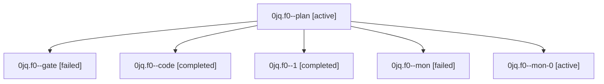

# Family: 0jq.f0

[Agent Hoods](../README.md) / [bbugyi200](../users/bbugyi200/README.md) / [athena](../users/bbugyi200/machines/athena/README.md) / [0jq](../users/bbugyi200/machines/athena/hoods/0jq/README.md) / 0jq.f0

Owner: `bbugyi200.athena` · Hood: `0jq` · Members: 6

## Lineage

The diagram is an optional enhancement; the ordered table below contains the same lineage in accessible text.

| Role | Agent | State | Model / provider | Timing | Commits | Prompt | Chat |
|---|---|---|---|---|---:|---|---|
| plan | 0jq.f0--plan | active | opus / claude | 2026-09-12T09:03:12.761650+00:00 | 0 | [Prompt](../agents/bbugyi200.athena.0jq.f0--plan/prompt.md) | [Chat](../agents/bbugyi200.athena.0jq.f0--plan/chat.md) |
| gate | 0jq.f0--gate | failed | opus / claude | 2026-09-12T09:22:32.941464+00:00 → 2026-09-12T09:34:08.764894+00:00 | 0 | — | [Chat](../agents/bbugyi200.athena.0jq.f0--gate/chat.md) |
| code | 0jq.f0--code | completed | sonnet / claude | 2026-09-12T09:34:27.857436+00:00 → 2026-09-12T09:53:03.011338+00:00 | 0 | [Prompt](../agents/bbugyi200.athena.0jq.f0--code/prompt.md) | [Chat](../agents/bbugyi200.athena.0jq.f0--code/chat.md) |
| 1 | 0jq.f0--1 | completed | sonnet / claude | 2026-09-12T11:16:32.243619+00:00 → 2026-09-12T11:35:11.330278+00:00 | 0 | [Prompt](../agents/bbugyi200.athena.0jq.f0--1/prompt.md) | [Chat](../agents/bbugyi200.athena.0jq.f0--1/chat.md) |
| mon | 0jq.f0--mon | failed | sonnet / claude | 2026-09-12T09:52:12.511063+00:00 → 2026-09-12T10:23:45.193560+00:00 | 0 | — | [Chat](../agents/bbugyi200.athena.0jq.f0--mon/chat.md) |
| mon-0 | 0jq.f0--mon-0 | active | sonnet / claude | 2026-09-12T11:34:50.037583+00:00 | 0 | — | — |

## Neighbors

| Agent | Relation | State |
|---|---|---|
| [0jq](bbugyi200.athena.0jq.md) (family · 5) | ancestor | active 1, completed 2, failed 2 |
