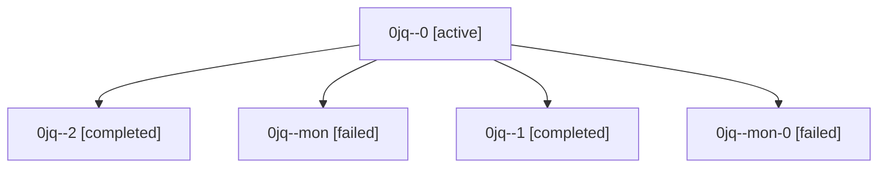

# Family: 0jq

[Agent Hoods](../README.md) / [bbugyi200](../users/bbugyi200/README.md) / [athena](../users/bbugyi200/machines/athena/README.md) / [0jq](../users/bbugyi200/machines/athena/hoods/0jq/README.md) / 0jq

Owner: `bbugyi200.athena` · Hood: `0jq` · Members: 5

## Lineage

The diagram is an optional enhancement; the ordered table below contains the same lineage in accessible text.

| Role | Agent | State | Model / provider | Timing | Commits | Prompt | Chat |
|---|---|---|---|---|---:|---|---|
| 0 | 0jq--0 | active | grok-4.6 / grok | 2026-09-11T19:17:40.926215+00:00 | 0 | [Prompt](../agents/bbugyi200.athena.0jq--0/prompt.md) | [Chat](../agents/bbugyi200.athena.0jq--0/chat.md) |
| 2 | 0jq--2 | completed | gpt-5.5 / codex | 2026-09-11T21:26:27.611701+00:00 → 2026-09-12T05:22:28.789722+00:00 | [1](../agents/bbugyi200.athena.0jq--2/README.md#commits) | [Prompt](../agents/bbugyi200.athena.0jq--2/prompt.md) | [Chat](../agents/bbugyi200.athena.0jq--2/chat.md) |
| mon | 0jq--mon | failed | grok-4.6 / grok | 2026-09-11T19:53:28.837724+00:00 → 2026-09-11T20:24:42.388283+00:00 | 0 | — | [Chat](../agents/bbugyi200.athena.0jq--mon/chat.md) |
| 1 | 0jq--1 | completed | grok-4.6 / grok | 2026-09-11T20:37:53.792915+00:00 → 2026-09-11T20:50:03.609118+00:00 | 0 | [Prompt](../agents/bbugyi200.athena.0jq--1/prompt.md) | [Chat](../agents/bbugyi200.athena.0jq--1/chat.md) |
| mon-0 | 0jq--mon-0 | failed | grok-4.6 / grok | 2026-09-11T20:48:27.121118+00:00 → 2026-09-11T21:25:59.019036+00:00 | 0 | — | [Chat](../agents/bbugyi200.athena.0jq--mon-0/chat.md) |

## Commits

| Role | Repo | Commit | Subject | Committed |
|---|---|---|---|---|
| 2 | sase | [`e2229a6`](https://github.com/sase-org/sase/commit/e2229a6803cc99ee82d27eb9a1007d93e950bfdf) | feat(ace): show usage windows in header | 2026-09-12 01:15:20 EDT |

## Neighbors

| Agent | Relation | State |
|---|---|---|
| [0jq.f0](bbugyi200.athena.0jq.f0.md) (family · 6) | descendant | active 2, completed 2, failed 2 |
