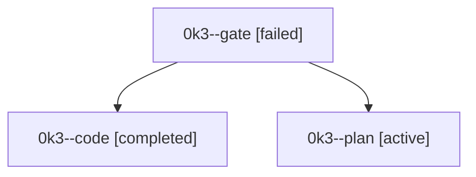

# Family: 0k3

[Agent Hoods](../README.md) / [bbugyi200](../users/bbugyi200/README.md) / [athena](../users/bbugyi200/machines/athena/README.md) / [0k3](../users/bbugyi200/machines/athena/hoods/0k3/README.md) / 0k3

Owner: `bbugyi200.athena` · Hood: `0k3` · Members: 3

## Lineage

The diagram is an optional enhancement; the ordered table below contains the same lineage in accessible text.

| Role | Agent | State | Model / provider | Timing | Commits | Prompt | Chat |
|---|---|---|---|---|---:|---|---|
| gate | 0k3--gate | failed | gpt-6-astra / codex | 2026-09-12T12:24:48.554029+00:00 → 2026-09-12T12:25:36.184302+00:00 | 0 | — | [Chat](../agents/bbugyi200.athena.0k3--gate/chat.md) |
| code | 0k3--code | completed | gpt-5.5 / codex | 2026-09-12T12:25:56.852383+00:00 → 2026-09-12T13:45:17.489246+00:00 | [1](../agents/bbugyi200.athena.0k3--code/README.md#commits) | [Prompt](../agents/bbugyi200.athena.0k3--code/prompt.md) | [Chat](../agents/bbugyi200.athena.0k3--code/chat.md) |
| plan | 0k3--plan | active | gpt-6-astra / codex | 2026-09-12T11:12:45.085068+00:00 | 0 | [Prompt](../agents/bbugyi200.athena.0k3--plan/prompt.md) | [Chat](../agents/bbugyi200.athena.0k3--plan/chat.md) |

## Commits

| Role | Repo | Commit | Subject | Committed |
|---|---|---|---|---|
| code | sase | [`0be51f9`](https://github.com/sase-org/sase/commit/0be51f9007c480d1e33d534a7b33c0f712de1e4c) | fix(commit): diagnose stitch hook timeouts | 2026-09-12 09:42:06 EDT |
