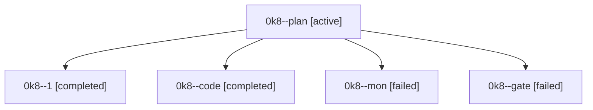

# Family: 0k8

[Agent Hoods](../README.md) / [bbugyi200](../users/bbugyi200/README.md) / [athena](../users/bbugyi200/machines/athena/README.md) / [0k8](../users/bbugyi200/machines/athena/hoods/0k8/README.md) / 0k8

Owner: `bbugyi200.athena` · Hood: `0k8` · Members: 5

## Lineage

The diagram is an optional enhancement; the ordered table below contains the same lineage in accessible text.

| Role | Agent | State | Model / provider | Timing | Commits | Prompt | Chat |
|---|---|---|---|---|---:|---|---|
| plan | 0k8--plan | active | opus / claude | 2026-09-12T13:26:09.314198+00:00 | 0 | [Prompt](../agents/bbugyi200.athena.0k8--plan/prompt.md) | [Chat](../agents/bbugyi200.athena.0k8--plan/chat.md) |
| 1 | 0k8--1 | completed | gpt-5.5 / codex | 2026-09-12T15:13:43.467869+00:00 → 2026-09-12T19:44:15.639525+00:00 | [1](../agents/bbugyi200.athena.0k8--1/README.md#commits) | [Prompt](../agents/bbugyi200.athena.0k8--1/prompt.md) | [Chat](../agents/bbugyi200.athena.0k8--1/chat.md) |
| code | 0k8--code | completed | gpt-5.5 / codex | 2026-09-12T13:42:27.350981+00:00 → 2026-09-12T14:13:55.401304+00:00 | 0 | [Prompt](../agents/bbugyi200.athena.0k8--code/prompt.md) | [Chat](../agents/bbugyi200.athena.0k8--code/chat.md) |
| mon | 0k8--mon | failed | gpt-5.5 / codex | 2026-09-12T14:12:21.300974+00:00 → 2026-09-12T15:13:43.885562+00:00 | 0 | — | [Chat](../agents/bbugyi200.athena.0k8--mon/chat.md) |
| gate | 0k8--gate | failed | opus / claude | 2026-09-12T13:40:46.972647+00:00 → 2026-09-12T13:42:10.024140+00:00 | 0 | — | [Chat](../agents/bbugyi200.athena.0k8--gate/chat.md) |

## Commits

| Role | Repo | Commit | Subject | Committed |
|---|---|---|---|---|
| 1 | sase | [`e1a2f78`](https://github.com/sase-org/sase/commit/e1a2f7839502dd228fc4ab29687c4256f3cf055c) | fix(agent): break monitor import cycle | 2026-09-12 15:40:42 EDT |
