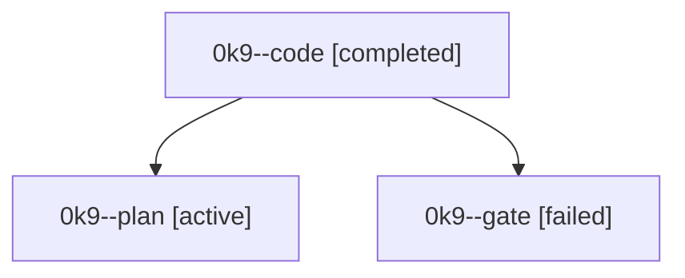

# Family: 0k9

[Agent Hoods](../README.md) / [bbugyi200](../users/bbugyi200/README.md) / [athena](../users/bbugyi200/machines/athena/README.md) / [0k9](../users/bbugyi200/machines/athena/hoods/0k9/README.md) / 0k9

Owner: `bbugyi200.athena` · Hood: `0k9` · Members: 3

## Lineage

The diagram is an optional enhancement; the ordered table below contains the same lineage in accessible text.

| Role | Agent | State | Model / provider | Timing | Commits | Prompt | Chat |
|---|---|---|---|---|---:|---|---|
| code | 0k9--code | completed | gpt-5.5 / codex | 2026-09-12T16:16:36.287313+00:00 → 2026-09-12T17:19:17.549738+00:00 | [1](../agents/bbugyi200.athena.0k9--code/README.md#commits) | [Prompt](../agents/bbugyi200.athena.0k9--code/prompt.md) | [Chat](../agents/bbugyi200.athena.0k9--code/chat.md) |
| plan | 0k9--plan | active | opus / claude | 2026-09-12T14:48:09.994144+00:00 | 0 | [Prompt](../agents/bbugyi200.athena.0k9--plan/prompt.md) | [Chat](../agents/bbugyi200.athena.0k9--plan/chat.md) |
| gate | 0k9--gate | failed | opus / claude | 2026-09-12T15:35:50.341027+00:00 → 2026-09-12T16:11:00.557376+00:00 | 0 | — | [Chat](../agents/bbugyi200.athena.0k9--gate/chat.md) |

## Commits

| Role | Repo | Commit | Subject | Committed |
|---|---|---|---|---|
| code | sase | [`f2bb0af`](https://github.com/sase-org/sase/commit/f2bb0af043a70767812b85f02e248e0157b24ec9) | fix(tui): pin agents metadata bottom scroll | 2026-09-12 13:18:17 EDT |
