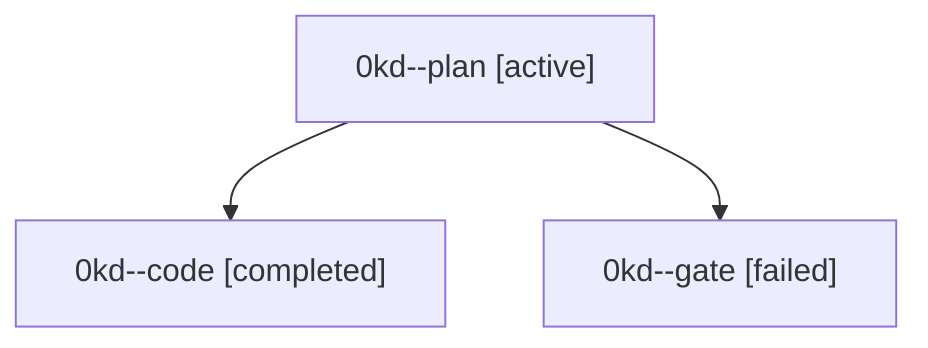

# Family: 0kd

[Agent Hoods](../README.md) / [bbugyi200](../users/bbugyi200/README.md) / [athena](../users/bbugyi200/machines/athena/README.md) / [0kd](../users/bbugyi200/machines/athena/hoods/0kd/README.md) / 0kd

Owner: `bbugyi200.athena` · Hood: `0kd` · Members: 3

## Lineage

The diagram is an optional enhancement; the ordered table below contains the same lineage in accessible text.

| Role | Agent | State | Model / provider | Timing | Commits | Prompt | Chat |
|---|---|---|---|---|---:|---|---|
| plan | 0kd--plan | active | opus / claude | 2026-09-12T19:51:01.671861+00:00 | 0 | [Prompt](../agents/bbugyi200.athena.0kd--plan/prompt.md) | [Chat](../agents/bbugyi200.athena.0kd--plan/chat.md) |
| code | 0kd--code | completed | sonnet / claude | 2026-09-13T08:44:37.100751+00:00 → 2026-09-13T09:13:05.753297+00:00 | [1](../agents/bbugyi200.athena.0kd--code/README.md#commits) | [Prompt](../agents/bbugyi200.athena.0kd--code/prompt.md) | [Chat](../agents/bbugyi200.athena.0kd--code/chat.md) |
| gate | 0kd--gate | failed | opus / claude | 2026-09-13T08:43:53.798911+00:00 → 2026-09-13T08:44:30.228861+00:00 | 0 | — | [Chat](../agents/bbugyi200.athena.0kd--gate/chat.md) |

## Commits

| Role | Repo | Commit | Subject | Committed |
|---|---|---|---|---|
| code | sase | [`817c5c5`](https://github.com/sase-org/sase/commit/817c5c5679154fffe7892e7124aa496782d9b8a7) | fix(gate\_shell): harden reclaim timeout handling with shared snapshot and pass-wide deadline | 2026-09-13 05:11:27 EDT |
