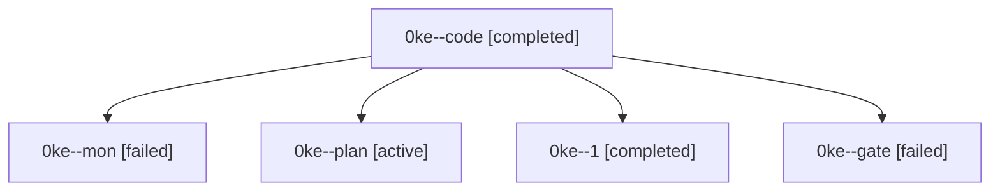

# Family: 0ke

[Agent Hoods](../README.md) / [bbugyi200](../users/bbugyi200/README.md) / [athena](../users/bbugyi200/machines/athena/README.md) / [0ke](../users/bbugyi200/machines/athena/hoods/0ke/README.md) / 0ke

Owner: `bbugyi200.athena` · Hood: `0ke` · Members: 5

## Lineage

The diagram is an optional enhancement; the ordered table below contains the same lineage in accessible text.

| Role | Agent | State | Model / provider | Timing | Commits | Prompt | Chat |
|---|---|---|---|---|---:|---|---|
| code | 0ke--code | completed | grok-4.6 / grok | 2026-09-13T08:45:42.164718+00:00 → 2026-09-13T09:36:26.939787+00:00 | 0 | [Prompt](../agents/bbugyi200.athena.0ke--code/prompt.md) | [Chat](../agents/bbugyi200.athena.0ke--code/chat.md) |
| mon | 0ke--mon | failed | grok-4.6 / grok | 2026-09-13T09:35:49.720639+00:00 → 2026-09-13T10:00:42.242332+00:00 | 0 | — | [Chat](../agents/bbugyi200.athena.0ke--mon/chat.md) |
| plan | 0ke--plan | active | opus / claude | 2026-09-12T20:15:42.417585+00:00 | 0 | [Prompt](../agents/bbugyi200.athena.0ke--plan/prompt.md) | [Chat](../agents/bbugyi200.athena.0ke--plan/chat.md) |
| 1 | 0ke--1 | completed | grok-4.6 / grok | 2026-09-13T10:00:41.829857+00:00 → 2026-09-13T10:08:11.758281+00:00 | [1](../agents/bbugyi200.athena.0ke--1/README.md#commits) | [Prompt](../agents/bbugyi200.athena.0ke--1/prompt.md) | [Chat](../agents/bbugyi200.athena.0ke--1/chat.md) |
| gate | 0ke--gate | failed | opus / claude | 2026-09-13T08:44:59.726185+00:00 → 2026-09-13T08:45:37.319057+00:00 | 0 | — | [Chat](../agents/bbugyi200.athena.0ke--gate/chat.md) |

## Commits

| Role | Repo | Commit | Subject | Committed |
|---|---|---|---|---|
| 1 | sase | [`9429544`](https://github.com/sase-org/sase/commit/9429544b531f1c12120ee969ab724ebf0fb2ab27) | feat(beads): make --capacity admissible for every epic segment | 2026-09-13 06:05:49 EDT |
