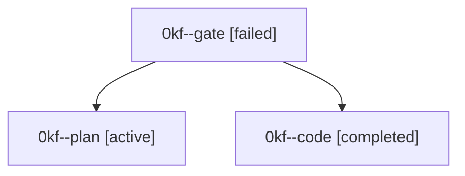

# Family: 0kf

[Agent Hoods](../README.md) / [bbugyi200](../users/bbugyi200/README.md) / [athena](../users/bbugyi200/machines/athena/README.md) / [0kf](../users/bbugyi200/machines/athena/hoods/0kf/README.md) / 0kf

Owner: `bbugyi200.athena` · Hood: `0kf` · Members: 3

## Lineage

The diagram is an optional enhancement; the ordered table below contains the same lineage in accessible text.

| Role | Agent | State | Model / provider | Timing | Commits | Prompt | Chat |
|---|---|---|---|---|---:|---|---|
| gate | 0kf--gate | failed | claude-fable-5 / claude | 2026-09-14T01:44:08.739332+00:00 → 2026-09-14T01:45:13.603467+00:00 | 0 | — | [Chat](../agents/bbugyi200.athena.0kf--gate/chat.md) |
| plan | 0kf--plan | active | claude-fable-5 / claude | 2026-09-14T01:28:58.564991+00:00 | 0 | [Prompt](../agents/bbugyi200.athena.0kf--plan/prompt.md) | [Chat](../agents/bbugyi200.athena.0kf--plan/chat.md) |
| code | 0kf--code | completed | sonnet / claude | 2026-09-14T01:45:30.461446+00:00 → 2026-09-14T02:28:46.706482+00:00 | [1](../agents/bbugyi200.athena.0kf--code/README.md#commits) | [Prompt](../agents/bbugyi200.athena.0kf--code/prompt.md) | [Chat](../agents/bbugyi200.athena.0kf--code/chat.md) |

## Commits

| Role | Repo | Commit | Subject | Committed |
|---|---|---|---|---|
| code | sase | [`a59ded7`](https://github.com/sase-org/sase/commit/a59ded7669c59b7e80fc5d1794ff6e15f7e26c93) | feat(ace,pager): open agent metadata in the pager with V | 2026-09-13 22:21:01 EDT |
