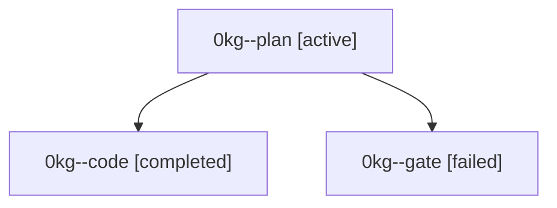

# Family: 0kg

[Agent Hoods](../README.md) / [bbugyi200](../users/bbugyi200/README.md) / [athena](../users/bbugyi200/machines/athena/README.md) / [0kg](../users/bbugyi200/machines/athena/hoods/0kg/README.md) / 0kg

Owner: `bbugyi200.athena` · Hood: `0kg` · Members: 3

## Lineage

The diagram is an optional enhancement; the ordered table below contains the same lineage in accessible text.

| Role | Agent | State | Model / provider | Timing | Commits | Prompt | Chat |
|---|---|---|---|---|---:|---|---|
| plan | 0kg--plan | active | gpt-6-astra / codex | 2026-09-14T11:21:47.872800+00:00 | 0 | [Prompt](../agents/bbugyi200.athena.0kg--plan/prompt.md) | [Chat](../agents/bbugyi200.athena.0kg--plan/chat.md) |
| code | 0kg--code | completed | gpt-5.5 / codex | 2026-09-14T11:31:53.432960+00:00 → 2026-09-14T12:48:34.393804+00:00 | [1](../agents/bbugyi200.athena.0kg--code/README.md#commits) | [Prompt](../agents/bbugyi200.athena.0kg--code/prompt.md) | [Chat](../agents/bbugyi200.athena.0kg--code/chat.md) |
| gate | 0kg--gate | failed | gpt-6-astra / codex | 2026-09-14T11:30:14.012123+00:00 → 2026-09-14T11:31:34.293582+00:00 | 0 | — | [Chat](../agents/bbugyi200.athena.0kg--gate/chat.md) |

## Commits

| Role | Repo | Commit | Subject | Committed |
|---|---|---|---|---|
| code | sase | [`f86056c`](https://github.com/sase-org/sase/commit/f86056c7fd08d94f6dcf0ce2ac094249fc9f54ea) | feat(ace): convert argument colons when typing parens | 2026-09-14 08:41:47 EDT |
