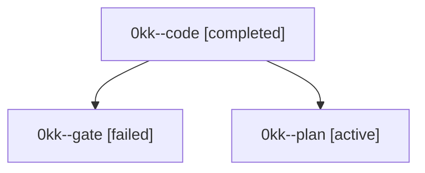

# Family: 0kk

[Agent Hoods](../README.md) / [bbugyi200](../users/bbugyi200/README.md) / [athena](../users/bbugyi200/machines/athena/README.md) / [0kk](../users/bbugyi200/machines/athena/hoods/0kk/README.md) / 0kk

Owner: `bbugyi200.athena` · Hood: `0kk` · Members: 3

## Lineage

The diagram is an optional enhancement; the ordered table below contains the same lineage in accessible text.

| Role | Agent | State | Model / provider | Timing | Commits | Prompt | Chat |
|---|---|---|---|---|---:|---|---|
| code | 0kk--code | completed | gpt-5.5 / codex | 2026-09-14T14:52:56.145631+00:00 → 2026-09-14T16:06:44.583323+00:00 | [1](../agents/bbugyi200.athena.0kk--code/README.md#commits) | [Prompt](../agents/bbugyi200.athena.0kk--code/prompt.md) | [Chat](../agents/bbugyi200.athena.0kk--code/chat.md) |
| gate | 0kk--gate | failed | opus / claude | 2026-09-14T14:51:29.491531+00:00 → 2026-09-14T14:52:34.358879+00:00 | 0 | — | [Chat](../agents/bbugyi200.athena.0kk--gate/chat.md) |
| plan | 0kk--plan | active | opus / claude | 2026-09-14T14:32:51.310283+00:00 | 0 | [Prompt](../agents/bbugyi200.athena.0kk--plan/prompt.md) | [Chat](../agents/bbugyi200.athena.0kk--plan/chat.md) |

## Commits

| Role | Repo | Commit | Subject | Committed |
|---|---|---|---|---|
| code | sase | [`59dde52`](https://github.com/sase-org/sase/commit/59dde523c37cbc0d629cdab41e82d89c986cdccb) | feat(axe): clean launch scratch on runner exit | 2026-09-14 11:59:47 EDT |
