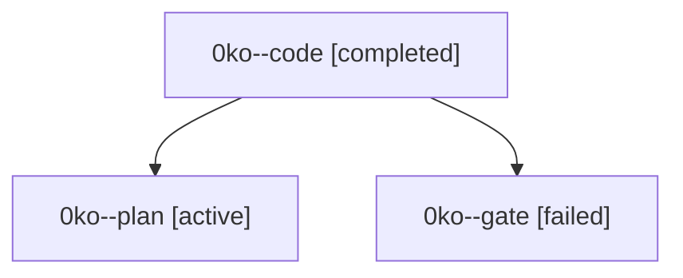

# Family: 0ko

[Agent Hoods](../README.md) / [bbugyi200](../users/bbugyi200/README.md) / [athena](../users/bbugyi200/machines/athena/README.md) / [0ko](../users/bbugyi200/machines/athena/hoods/0ko/README.md) / 0ko

Owner: `bbugyi200.athena` · Hood: `0ko` · Members: 3

## Lineage

The diagram is an optional enhancement; the ordered table below contains the same lineage in accessible text.

| Role | Agent | State | Model / provider | Timing | Commits | Prompt | Chat |
|---|---|---|---|---|---:|---|---|
| code | 0ko--code | completed | gpt-5.5 / codex | 2026-09-14T16:05:40.422788+00:00 → 2026-09-14T17:10:38.292700+00:00 | [1](../agents/bbugyi200.athena.0ko--code/README.md#commits) | [Prompt](../agents/bbugyi200.athena.0ko--code/prompt.md) | [Chat](../agents/bbugyi200.athena.0ko--code/chat.md) |
| plan | 0ko--plan | active | gpt-6-astra / codex | 2026-09-14T15:48:07.743333+00:00 | 0 | [Prompt](../agents/bbugyi200.athena.0ko--plan/prompt.md) | [Chat](../agents/bbugyi200.athena.0ko--plan/chat.md) |
| gate | 0ko--gate | failed | gpt-6-astra / codex | 2026-09-14T16:04:15.539718+00:00 → 2026-09-14T16:05:18.287261+00:00 | 0 | — | [Chat](../agents/bbugyi200.athena.0ko--gate/chat.md) |

## Commits

| Role | Repo | Commit | Subject | Committed |
|---|---|---|---|---|
| code | sase | [`04005a2`](https://github.com/sase-org/sase/commit/04005a222c6648aeccd2200ecbc035ac222c5f12) | fix(bead): verify worker stops before forced reuse | 2026-09-14 12:57:35 EDT |
