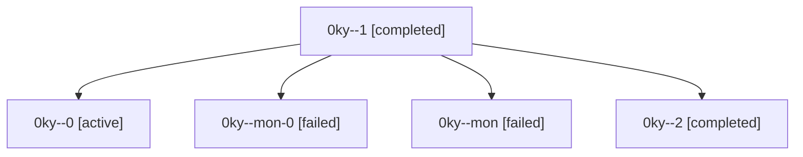

# Family: 0ky

[Agent Hoods](../README.md) / [bbugyi200](../users/bbugyi200/README.md) / [athena](../users/bbugyi200/machines/athena/README.md) / [0ky](../users/bbugyi200/machines/athena/hoods/0ky/README.md) / 0ky

Owner: `bbugyi200.athena` · Hood: `0ky` · Members: 5

## Lineage

The diagram is an optional enhancement; the ordered table below contains the same lineage in accessible text.

| Role | Agent | State | Model / provider | Timing | Commits | Prompt | Chat |
|---|---|---|---|---|---:|---|---|
| 1 | 0ky--1 | completed | gpt-6-astra / codex | 2026-09-14T19:38:33.993266+00:00 → 2026-09-14T19:45:28.632281+00:00 | 0 | [Prompt](../agents/bbugyi200.athena.0ky--1/prompt.md) | [Chat](../agents/bbugyi200.athena.0ky--1/chat.md) |
| 0 | 0ky--0 | active | gpt-6-astra / codex | 2026-09-14T19:09:33.883484+00:00 | 0 | [Prompt](../agents/bbugyi200.athena.0ky--0/prompt.md) | [Chat](../agents/bbugyi200.athena.0ky--0/chat.md) |
| mon-0 | 0ky--mon-0 | failed | gpt-6-astra / codex | 2026-09-14T19:45:07.906436+00:00 → 2026-09-14T20:12:33.451990+00:00 | 0 | — | [Chat](../agents/bbugyi200.athena.0ky--mon-0/chat.md) |
| mon | 0ky--mon | failed | gpt-6-astra / codex | 2026-09-14T19:21:02.203887+00:00 → 2026-09-14T19:38:34.311104+00:00 | 0 | — | [Chat](../agents/bbugyi200.athena.0ky--mon/chat.md) |
| 2 | 0ky--2 | completed | gpt-6-astra / codex | 2026-09-14T20:12:33.103496+00:00 → 2026-09-14T20:19:02.559574+00:00 | [1](../agents/bbugyi200.athena.0ky--2/README.md#commits) | [Prompt](../agents/bbugyi200.athena.0ky--2/prompt.md) | [Chat](../agents/bbugyi200.athena.0ky--2/chat.md) |

## Commits

| Role | Repo | Commit | Subject | Committed |
|---|---|---|---|---|
| 2 | sase | [`00acd60`](https://github.com/sase-org/sase/commit/00acd607fa0a303cd767fd001d2ff12d2f7e4ea2) | fix(pager): include agent prompts and replies in metadata view | 2026-09-14 16:16:32 EDT |

## Neighbors

| Agent | Relation | State |
|---|---|---|
| [0ky.w0](bbugyi200.athena.0ky.w0.md) (family · 3) | descendant | active 1, failed 2 |
