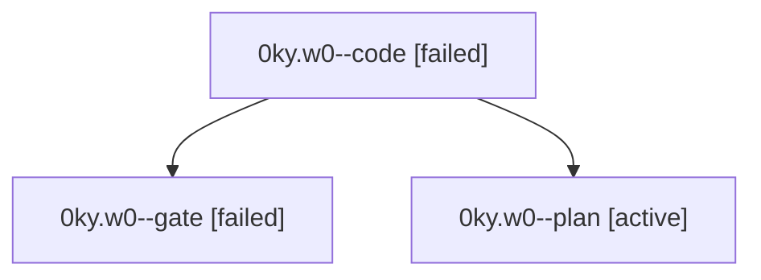

# Family: 0ky.w0

[Agent Hoods](../README.md) / [bbugyi200](../users/bbugyi200/README.md) / [athena](../users/bbugyi200/machines/athena/README.md) / [0ky](../users/bbugyi200/machines/athena/hoods/0ky/README.md) / 0ky.w0

Owner: `bbugyi200.athena` · Hood: `0ky` · Members: 3

## Lineage

The diagram is an optional enhancement; the ordered table below contains the same lineage in accessible text.

| Role | Agent | State | Model / provider | Timing | Commits | Prompt | Chat |
|---|---|---|---|---|---:|---|---|
| code | 0ky.w0--code | failed | gpt-5.5 / codex | 2026-09-14T20:48:27.123988+00:00 → 2026-09-14T21:00:59.527326+00:00 | 0 | [Prompt](../agents/bbugyi200.athena.0ky.w0--code/prompt.md) | — |
| gate | 0ky.w0--gate | failed | gpt-6-astra / codex | 2026-09-14T20:26:55.572470+00:00 → 2026-09-14T20:29:18.885346+00:00 | 0 | — | [Chat](../agents/bbugyi200.athena.0ky.w0--gate/chat.md) |
| plan | 0ky.w0--plan | active | gpt-6-astra / codex | 2026-09-14T20:19:01.736978+00:00 | 0 | [Prompt](../agents/bbugyi200.athena.0ky.w0--plan/prompt.md) | [Chat](../agents/bbugyi200.athena.0ky.w0--plan/chat.md) |

## Neighbors

| Agent | Relation | State |
|---|---|---|
| [0ky](bbugyi200.athena.0ky.md) (family · 5) | ancestor | active 1, completed 2, failed 2 |
