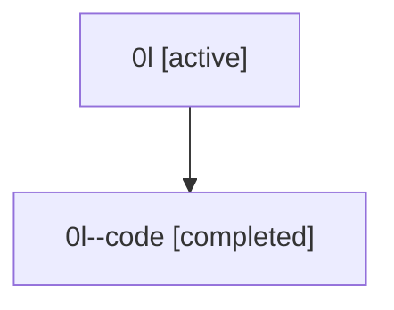

# Family: 0l

[Agent Hoods](../README.md) / [bbugyi200](../users/bbugyi200/README.md) / [athena](../users/bbugyi200/machines/athena/README.md) / [0l](../users/bbugyi200/machines/athena/hoods/0l/README.md) / 0l

Owner: `bbugyi200.athena` · Hood: `0l` · Members: 2

## Lineage

The diagram is an optional enhancement; the ordered table below contains the same lineage in accessible text.

| Role | Agent | State | Model / provider | Timing | Commits | Prompt | Chat |
|---|---|---|---|---|---:|---|---|
| root | 0l | active | claude-fable-5 / claude | 2026-07-07T16:42:15.474406+00:00 | [2](../agents/bbugyi200.athena.0l/README.md#commits) | [Prompt](../agents/bbugyi200.athena.0l/prompt.md) | [Chat](../agents/bbugyi200.athena.0l/chat.md) |
| code | 0l--code | completed | gpt-5.5 / codex | 2026-07-07T16:47:41.761505+00:00 | 0 | — | [Chat](../agents/bbugyi200.athena.0l--code/chat.md) |

## Commits

| Role | Repo | Commit | Subject | Committed |
|---|---|---|---|---|
| root | sase | [`805fe94`](https://github.com/sase-org/sase/commit/805fe9452ff18df7de915da13f88674e5bb86251) | chore: Add SDD prompt and plan for fix\_sase\_github\_ci\_dependency\_floor | 2026-07-07 12:47:40 EDT |
| root | sase | [`22890c6`](https://github.com/sase-org/sase/commit/22890c6f4f95133243a36d0d2a9f2a550583852e) | chore: Mark SDD plan done | 2026-07-07 13:42:05 EDT |
