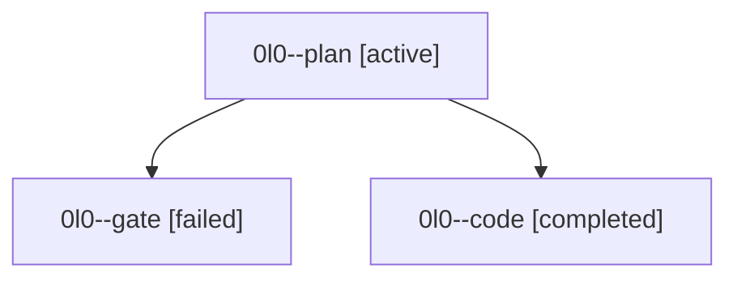

# Family: 0l0

[Agent Hoods](../README.md) / [bbugyi200](../users/bbugyi200/README.md) / [athena](../users/bbugyi200/machines/athena/README.md) / [0l0](../users/bbugyi200/machines/athena/hoods/0l0/README.md) / 0l0

Owner: `bbugyi200.athena` · Hood: `0l0` · Members: 3

## Lineage

The diagram is an optional enhancement; the ordered table below contains the same lineage in accessible text.

| Role | Agent | State | Model / provider | Timing | Commits | Prompt | Chat |
|---|---|---|---|---|---:|---|---|
| plan | 0l0--plan | active | claude-fable-5 / claude | 2026-09-14T19:29:32.047502+00:00 | 0 | [Prompt](../agents/bbugyi200.athena.0l0--plan/prompt.md) | [Chat](../agents/bbugyi200.athena.0l0--plan/chat.md) |
| gate | 0l0--gate | failed | claude-fable-5 / claude | 2026-09-14T19:42:08.718257+00:00 → 2026-09-14T19:42:55.660405+00:00 | 0 | — | [Chat](../agents/bbugyi200.athena.0l0--gate/chat.md) |
| code | 0l0--code | completed | gpt-5.5 / codex | 2026-09-14T19:43:19.819786+00:00 → 2026-09-14T19:58:13.258013+00:00 | [1](../agents/bbugyi200.athena.0l0--code/README.md#commits) | [Prompt](../agents/bbugyi200.athena.0l0--code/prompt.md) | [Chat](../agents/bbugyi200.athena.0l0--code/chat.md) |

## Commits

| Role | Repo | Commit | Subject | Committed |
|---|---|---|---|---|
| code | sase | [`3efd7d6`](https://github.com/sase-org/sase/commit/3efd7d6c605a84a4e7ff57ee61e1ff6b2c9733e5) | fix(tui): mirror queued family row status | 2026-09-14 15:55:29 EDT |
