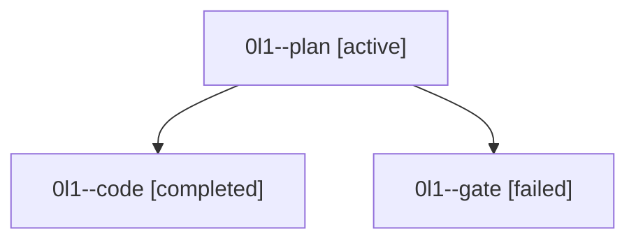

# Family: 0l1

[Agent Hoods](../README.md) / [bbugyi200](../users/bbugyi200/README.md) / [athena](../users/bbugyi200/machines/athena/README.md) / [0l1](../users/bbugyi200/machines/athena/hoods/0l1/README.md) / 0l1

Owner: `bbugyi200.athena` · Hood: `0l1` · Members: 3

## Lineage

The diagram is an optional enhancement; the ordered table below contains the same lineage in accessible text.

| Role | Agent | State | Model / provider | Timing | Commits | Prompt | Chat |
|---|---|---|---|---|---:|---|---|
| plan | 0l1--plan | active | claude-fable-5 / claude | 2026-09-15T10:50:32.232869+00:00 | 0 | [Prompt](../agents/bbugyi200.athena.0l1--plan/prompt.md) | [Chat](../agents/bbugyi200.athena.0l1--plan/chat.md) |
| code | 0l1--code | completed | gpt-5.5 / codex | 2026-09-15T11:33:59.066283+00:00 → 2026-09-15T11:59:58.394541+00:00 | [1](../agents/bbugyi200.athena.0l1--code/README.md#commits) | [Prompt](../agents/bbugyi200.athena.0l1--code/prompt.md) | [Chat](../agents/bbugyi200.athena.0l1--code/chat.md) |
| gate | 0l1--gate | failed | claude-fable-5 / claude | 2026-09-15T11:33:02.177396+00:00 → 2026-09-15T11:33:43.099412+00:00 | 0 | — | [Chat](../agents/bbugyi200.athena.0l1--gate/chat.md) |

## Commits

| Role | Repo | Commit | Subject | Committed |
|---|---|---|---|---|
| code | sase | [`d49b7fa`](https://github.com/sase-org/sase/commit/d49b7fa4d9819d47e846b7d540ede3e0f772d8c0) | fix(agent): preserve relaunch bead env and quarantine sidecars | 2026-09-15 07:57:53 EDT |
