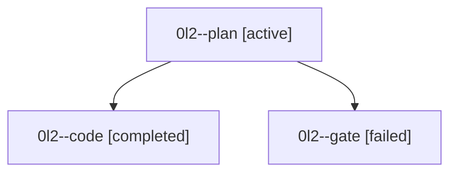

# Family: 0l2

[Agent Hoods](../README.md) / [bbugyi200](../users/bbugyi200/README.md) / [athena](../users/bbugyi200/machines/athena/README.md) / [0l2](../users/bbugyi200/machines/athena/hoods/0l2/README.md) / 0l2

Owner: `bbugyi200.athena` · Hood: `0l2` · Members: 3

## Lineage

The diagram is an optional enhancement; the ordered table below contains the same lineage in accessible text.

| Role | Agent | State | Model / provider | Timing | Commits | Prompt | Chat |
|---|---|---|---|---|---:|---|---|
| plan | 0l2--plan | active | gpt-6-astra / codex | 2026-09-15T11:02:08.873252+00:00 | 0 | [Prompt](../agents/bbugyi200.athena.0l2--plan/prompt.md) | [Chat](../agents/bbugyi200.athena.0l2--plan/chat.md) |
| code | 0l2--code | completed | gpt-5.5 / codex | 2026-09-15T11:34:57.830063+00:00 → 2026-09-15T12:21:42.230977+00:00 | [1](../agents/bbugyi200.athena.0l2--code/README.md#commits) | [Prompt](../agents/bbugyi200.athena.0l2--code/prompt.md) | [Chat](../agents/bbugyi200.athena.0l2--code/chat.md) |
| gate | 0l2--gate | failed | gpt-6-astra / codex | 2026-09-15T11:34:07.010716+00:00 → 2026-09-15T11:34:41.559964+00:00 | 0 | — | [Chat](../agents/bbugyi200.athena.0l2--gate/chat.md) |

## Commits

| Role | Repo | Commit | Subject | Committed |
|---|---|---|---|---|
| code | sase | [`3d32832`](https://github.com/sase-org/sase/commit/3d32832d0324b3b0cc692c7ff53da16b762b9e8d) | fix(pager): resolve owned home paths via filesystem | 2026-09-15 08:16:57 EDT |
