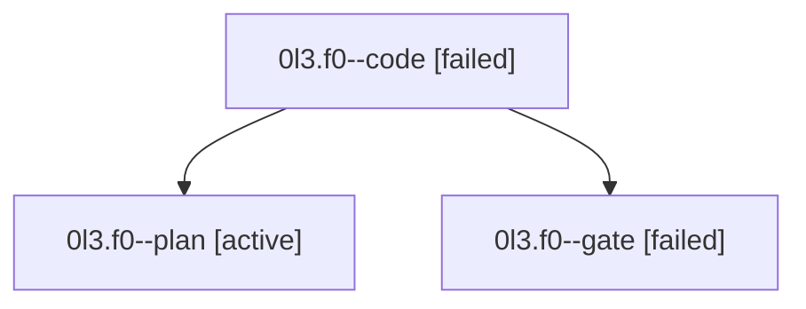

# Family: 0l3.f0

[Agent Hoods](../README.md) / [bbugyi200](../users/bbugyi200/README.md) / [athena](../users/bbugyi200/machines/athena/README.md) / [0l3](../users/bbugyi200/machines/athena/hoods/0l3/README.md) / 0l3.f0

Owner: `bbugyi200.athena` · Hood: `0l3` · Members: 3

## Lineage

The diagram is an optional enhancement; the ordered table below contains the same lineage in accessible text.

| Role | Agent | State | Model / provider | Timing | Commits | Prompt | Chat |
|---|---|---|---|---|---:|---|---|
| code | 0l3.f0--code | failed | gpt-5.5 / codex | 2026-09-15T14:34:41.235194+00:00 → 2026-09-15T15:41:19.604831+00:00 | [1](../agents/bbugyi200.athena.0l3.f0--code/README.md#commits) | [Prompt](../agents/bbugyi200.athena.0l3.f0--code/prompt.md) | — |
| plan | 0l3.f0--plan | active | gpt-6-astra / codex | 2026-09-15T14:18:24.966746+00:00 | 0 | [Prompt](../agents/bbugyi200.athena.0l3.f0--plan/prompt.md) | [Chat](../agents/bbugyi200.athena.0l3.f0--plan/chat.md) |
| gate | 0l3.f0--gate | failed | gpt-6-astra / codex | 2026-09-15T14:33:19.034027+00:00 → 2026-09-15T14:34:23.844157+00:00 | 0 | — | [Chat](../agents/bbugyi200.athena.0l3.f0--gate/chat.md) |

## Commits

| Role | Repo | Commit | Subject | Committed |
|---|---|---|---|---|
| code | sase | [`82fae37`](https://github.com/sase-org/sase/commit/82fae375ba1b42d26da385da58e8cf04699f63ff) | fix(completion): preserve zsh compsys context | 2026-09-15 11:38:48 EDT |

## Neighbors

| Agent | Relation | State |
|---|---|---|
| [0l3](bbugyi200.athena.0l3.md) (family · 3) | ancestor | active 1, completed 1, failed 1 |
| [0l3.f0.f0](../agents/bbugyi200.athena.0l3.f0.f0/README.md) | descendant | active |
