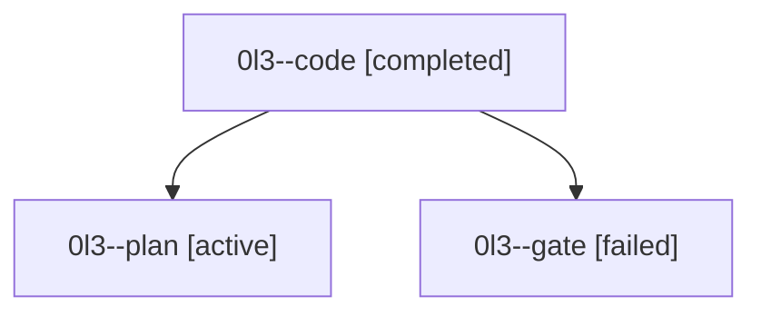

# Family: 0l3

[Agent Hoods](../README.md) / [bbugyi200](../users/bbugyi200/README.md) / [athena](../users/bbugyi200/machines/athena/README.md) / [0l3](../users/bbugyi200/machines/athena/hoods/0l3/README.md) / 0l3

Owner: `bbugyi200.athena` · Hood: `0l3` · Members: 3

## Lineage

The diagram is an optional enhancement; the ordered table below contains the same lineage in accessible text.

| Role | Agent | State | Model / provider | Timing | Commits | Prompt | Chat |
|---|---|---|---|---|---:|---|---|
| code | 0l3--code | completed | gpt-5.5 / codex | 2026-09-15T12:01:59.850340+00:00 → 2026-09-15T13:57:36.225838+00:00 | [1](../agents/bbugyi200.athena.0l3--code/README.md#commits) | [Prompt](../agents/bbugyi200.athena.0l3--code/prompt.md) | [Chat](../agents/bbugyi200.athena.0l3--code/chat.md) |
| plan | 0l3--plan | active | gpt-6-astra / codex | 2026-09-15T11:51:10.747282+00:00 | 0 | [Prompt](../agents/bbugyi200.athena.0l3--plan/prompt.md) | [Chat](../agents/bbugyi200.athena.0l3--plan/chat.md) |
| gate | 0l3--gate | failed | gpt-6-astra / codex | 2026-09-15T12:01:04.942415+00:00 → 2026-09-15T12:01:41.358008+00:00 | 0 | — | [Chat](../agents/bbugyi200.athena.0l3--gate/chat.md) |

## Commits

| Role | Repo | Commit | Subject | Committed |
|---|---|---|---|---|
| code | sase | [`acfc9c8`](https://github.com/sase-org/sase/commit/acfc9c86e8912f3c571eeab3b04a367bd0d80cb8) | feat(cli): add print-command root option | 2026-09-15 09:54:21 EDT |

## Neighbors

| Agent | Relation | State |
|---|---|---|
| [0l3.f0](bbugyi200.athena.0l3.f0.md) (family · 3) | descendant | active 1, failed 2 |
| [0l3.f0.f0](../agents/bbugyi200.athena.0l3.f0.f0/README.md) | descendant | active |
