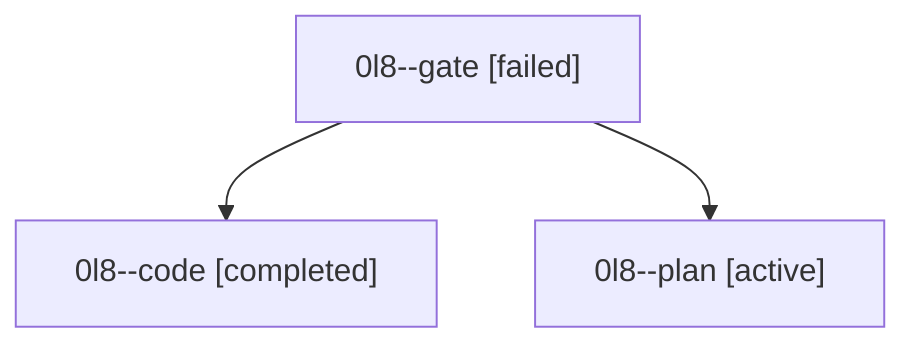

# Family: 0l8

[Agent Hoods](../README.md) / [bbugyi200](../users/bbugyi200/README.md) / [athena](../users/bbugyi200/machines/athena/README.md) / [0l8](../users/bbugyi200/machines/athena/hoods/0l8/README.md) / 0l8

Owner: `bbugyi200.athena` · Hood: `0l8` · Members: 3

## Lineage

The diagram is an optional enhancement; the ordered table below contains the same lineage in accessible text.

| Role | Agent | State | Model / provider | Timing | Commits | Prompt | Chat |
|---|---|---|---|---|---:|---|---|
| gate | 0l8--gate | failed | gpt-6-astra / codex | 2026-09-15T15:08:28.294270+00:00 → 2026-09-15T15:09:54.421507+00:00 | 0 | — | [Chat](../agents/bbugyi200.athena.0l8--gate/chat.md) |
| code | 0l8--code | completed | gpt-5.5 / codex | 2026-09-15T15:10:16.005280+00:00 → 2026-09-15T18:55:55.656152+00:00 | [1](../agents/bbugyi200.athena.0l8--code/README.md#commits) | [Prompt](../agents/bbugyi200.athena.0l8--code/prompt.md) | [Chat](../agents/bbugyi200.athena.0l8--code/chat.md) |
| plan | 0l8--plan | active | gpt-6-astra / codex | 2026-09-15T14:59:46.945803+00:00 | 0 | [Prompt](../agents/bbugyi200.athena.0l8--plan/prompt.md) | [Chat](../agents/bbugyi200.athena.0l8--plan/chat.md) |

## Commits

| Role | Repo | Commit | Subject | Committed |
|---|---|---|---|---|
| code | sase | [`4fc9e7a`](https://github.com/sase-org/sase/commit/4fc9e7ae49857cb925220d0758896accfa4b2054) | feat(cli)!: rename public ace command to tui | 2026-09-15 14:36:00 EDT |

## Neighbors

| Agent | Relation | State |
|---|---|---|
| [0l8.r0](bbugyi200.athena.0l8.r0.md) (family · 3) | descendant | active 1, failed 2 |
| [0l8.r1](../agents/bbugyi200.athena.0l8.r1/README.md) | descendant | waiting |
