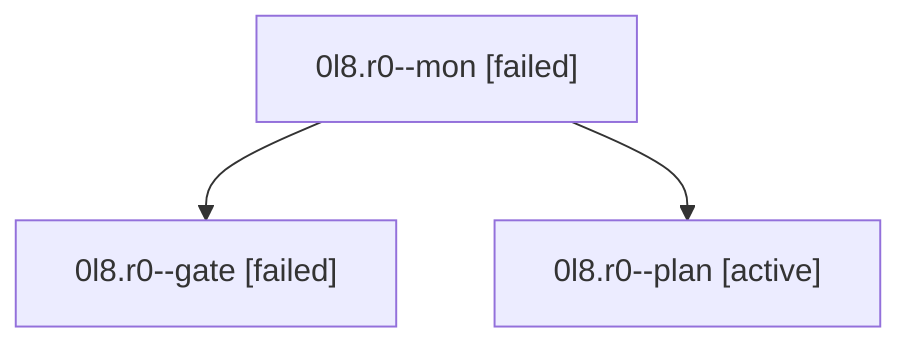

# Family: 0l8.r0

[Agent Hoods](../README.md) / [bbugyi200](../users/bbugyi200/README.md) / [athena](../users/bbugyi200/machines/athena/README.md) / [0l8](../users/bbugyi200/machines/athena/hoods/0l8/README.md) / 0l8.r0

Owner: `bbugyi200.athena` · Hood: `0l8` · Members: 3

## Lineage

The diagram is an optional enhancement; the ordered table below contains the same lineage in accessible text.

| Role | Agent | State | Model / provider | Timing | Commits | Prompt | Chat |
|---|---|---|---|---|---:|---|---|
| mon | 0l8.r0--mon | failed | gpt-6-astra / codex | 2026-09-15T19:18:36.530857+00:00 → 2026-09-15T19:21:14.652355+00:00 | 0 | — | [Chat](../agents/bbugyi200.athena.0l8.r0--mon/chat.md) |
| gate | 0l8.r0--gate | failed | gpt-6-astra / codex | 2026-09-15T19:17:41.594542+00:00 → 2026-09-15T19:18:44.690028+00:00 | 0 | — | [Chat](../agents/bbugyi200.athena.0l8.r0--gate/chat.md) |
| plan | 0l8.r0--plan | active | gpt-6-astra / codex | 2026-09-15T19:01:11.871194+00:00 | 0 | [Prompt](../agents/bbugyi200.athena.0l8.r0--plan/prompt.md) | [Chat](../agents/bbugyi200.athena.0l8.r0--plan/chat.md) |

## Neighbors

| Agent | Relation | State |
|---|---|---|
| [0l8](bbugyi200.athena.0l8.md) (family · 3) | ancestor | active 1, completed 1, failed 1 |
| [0l8.r1](../agents/bbugyi200.athena.0l8.r1/README.md) | 0l8 hood | waiting |
