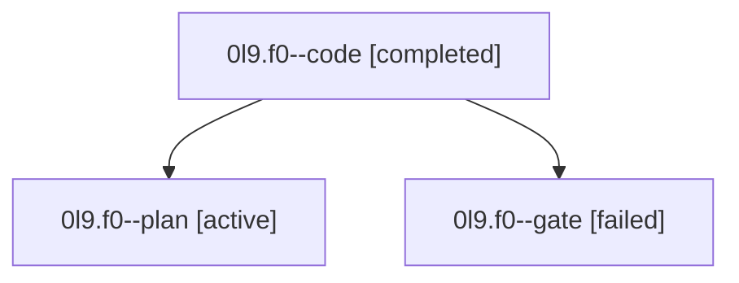

# Family: 0l9.f0

[Agent Hoods](../README.md) / [bbugyi200](../users/bbugyi200/README.md) / [athena](../users/bbugyi200/machines/athena/README.md) / [0l9](../users/bbugyi200/machines/athena/hoods/0l9/README.md) / 0l9.f0

Owner: `bbugyi200.athena` · Hood: `0l9` · Members: 3

## Lineage

The diagram is an optional enhancement; the ordered table below contains the same lineage in accessible text.

| Role | Agent | State | Model / provider | Timing | Commits | Prompt | Chat |
|---|---|---|---|---|---:|---|---|
| code | 0l9.f0--code | completed | gpt-5.5 / codex | 2026-09-15T16:42:00.837151+00:00 → 2026-09-15T17:06:06.831403+00:00 | [1](../agents/bbugyi200.athena.0l9.f0--code/README.md#commits) | [Prompt](../agents/bbugyi200.athena.0l9.f0--code/prompt.md) | [Chat](../agents/bbugyi200.athena.0l9.f0--code/chat.md) |
| plan | 0l9.f0--plan | active | claude-fable-5 / claude | 2026-09-15T16:20:04.238417+00:00 | 0 | [Prompt](../agents/bbugyi200.athena.0l9.f0--plan/prompt.md) | [Chat](../agents/bbugyi200.athena.0l9.f0--plan/chat.md) |
| gate | 0l9.f0--gate | failed | claude-fable-5 / claude | 2026-09-15T16:39:56.682956+00:00 → 2026-09-15T16:41:42.553445+00:00 | 0 | — | [Chat](../agents/bbugyi200.athena.0l9.f0--gate/chat.md) |

## Commits

| Role | Repo | Commit | Subject | Committed |
|---|---|---|---|---|
| code | sase | [`67cce7d`](https://github.com/sase-org/sase/commit/67cce7d82afbf8ae59525072c1fb103098e12d16) | feat(sudo): add acceptance docs and credential checks | 2026-09-15 13:03:38 EDT |

## Neighbors

| Agent | Relation | State |
|---|---|---|
| [0l9](bbugyi200.athena.0l9.md) (family · 3) | ancestor | active 1, completed 1, failed 1 |
