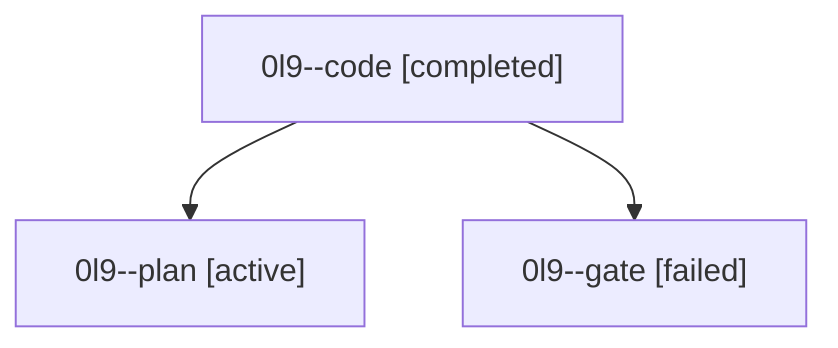

# Family: 0l9

[Agent Hoods](../README.md) / [bbugyi200](../users/bbugyi200/README.md) / [athena](../users/bbugyi200/machines/athena/README.md) / [0l9](../users/bbugyi200/machines/athena/hoods/0l9/README.md) / 0l9

Owner: `bbugyi200.athena` · Hood: `0l9` · Members: 3

## Lineage

The diagram is an optional enhancement; the ordered table below contains the same lineage in accessible text.

| Role | Agent | State | Model / provider | Timing | Commits | Prompt | Chat |
|---|---|---|---|---|---:|---|---|
| code | 0l9--code | completed | gpt-5.5 / codex | 2026-09-15T15:44:50.407833+00:00 → 2026-09-15T16:17:49.216920+00:00 | [1](../agents/bbugyi200.athena.0l9--code/README.md#commits) | [Prompt](../agents/bbugyi200.athena.0l9--code/prompt.md) | [Chat](../agents/bbugyi200.athena.0l9--code/chat.md) |
| plan | 0l9--plan | active | claude-fable-5 / claude | 2026-09-15T15:20:41.679847+00:00 | 0 | [Prompt](../agents/bbugyi200.athena.0l9--plan/prompt.md) | [Chat](../agents/bbugyi200.athena.0l9--plan/chat.md) |
| gate | 0l9--gate | failed | claude-fable-5 / claude | 2026-09-15T15:43:39.291757+00:00 → 2026-09-15T15:44:32.481757+00:00 | 0 | — | [Chat](../agents/bbugyi200.athena.0l9--gate/chat.md) |

## Commits

| Role | Repo | Commit | Subject | Committed |
|---|---|---|---|---|
| code | sase | [`688b2d4`](https://github.com/sase-org/sase/commit/688b2d4eac8f123b03303e37432ba9596c0aee79) | fix(sudo): unblock terminal handoff failures | 2026-09-15 12:15:49 EDT |

## Neighbors

| Agent | Relation | State |
|---|---|---|
| [0l9.f0](bbugyi200.athena.0l9.f0.md) (family · 3) | descendant | active 1, completed 1, failed 1 |
