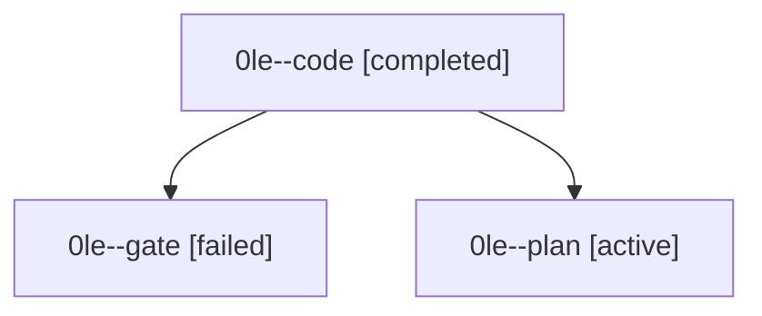

# Family: 0le

[Agent Hoods](../README.md) / [bbugyi200](../users/bbugyi200/README.md) / [athena](../users/bbugyi200/machines/athena/README.md) / [0le](../users/bbugyi200/machines/athena/hoods/0le/README.md) / 0le

Owner: `bbugyi200.athena` · Hood: `0le` · Members: 3

## Lineage

The diagram is an optional enhancement; the ordered table below contains the same lineage in accessible text.

| Role | Agent | State | Model / provider | Timing | Commits | Prompt | Chat |
|---|---|---|---|---|---:|---|---|
| code | 0le--code | completed | gpt-5.5 / codex | 2026-09-15T17:05:20.487991+00:00 → 2026-09-15T17:29:30.922407+00:00 | [1](../agents/bbugyi200.athena.0le--code/README.md#commits) | [Prompt](../agents/bbugyi200.athena.0le--code/prompt.md) | [Chat](../agents/bbugyi200.athena.0le--code/chat.md) |
| gate | 0le--gate | failed | gpt-6-astra / codex | 2026-09-15T17:04:16.778423+00:00 → 2026-09-15T17:05:01.768436+00:00 | 0 | — | [Chat](../agents/bbugyi200.athena.0le--gate/chat.md) |
| plan | 0le--plan | active | gpt-6-astra / codex | 2026-09-15T16:59:36.079992+00:00 | 0 | [Prompt](../agents/bbugyi200.athena.0le--plan/prompt.md) | [Chat](../agents/bbugyi200.athena.0le--plan/chat.md) |

## Commits

| Role | Repo | Commit | Subject | Committed |
|---|---|---|---|---|
| code | sase | [`53035c9`](https://github.com/sase-org/sase/commit/53035c96715c2052e3ccd5e9fbce63083b790731) | fix(retention): use aware prune preview timestamps | 2026-09-15 13:27:28 EDT |
