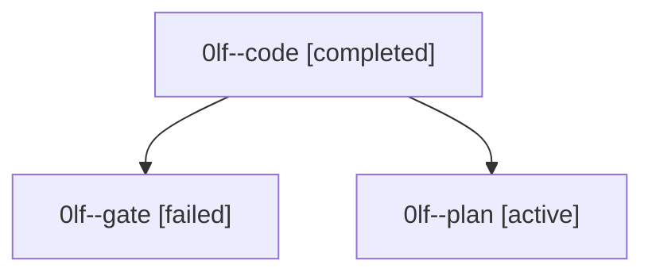

# Family: 0lf

[Agent Hoods](../README.md) / [bbugyi200](../users/bbugyi200/README.md) / [athena](../users/bbugyi200/machines/athena/README.md) / [0lf](../users/bbugyi200/machines/athena/hoods/0lf/README.md) / 0lf

Owner: `bbugyi200.athena` · Hood: `0lf` · Members: 3

## Lineage

The diagram is an optional enhancement; the ordered table below contains the same lineage in accessible text.

| Role | Agent | State | Model / provider | Timing | Commits | Prompt | Chat |
|---|---|---|---|---|---:|---|---|
| code | 0lf--code | completed | gpt-5.5 / codex | 2026-09-15T17:43:34.334350+00:00 → 2026-09-15T18:07:15.678455+00:00 | [1](../agents/bbugyi200.athena.0lf--code/README.md#commits) | [Prompt](../agents/bbugyi200.athena.0lf--code/prompt.md) | [Chat](../agents/bbugyi200.athena.0lf--code/chat.md) |
| gate | 0lf--gate | failed | gpt-6-astra / codex | 2026-09-15T17:41:47.074633+00:00 → 2026-09-15T17:43:09.896946+00:00 | 0 | — | [Chat](../agents/bbugyi200.athena.0lf--gate/chat.md) |
| plan | 0lf--plan | active | gpt-6-astra / codex | 2026-09-15T17:35:14.395287+00:00 | 0 | [Prompt](../agents/bbugyi200.athena.0lf--plan/prompt.md) | [Chat](../agents/bbugyi200.athena.0lf--plan/chat.md) |

## Commits

| Role | Repo | Commit | Subject | Committed |
|---|---|---|---|---|
| code | sase | [`c632a55`](https://github.com/sase-org/sase/commit/c632a5552d28893b1000d1ff9ff06c6dcffc708e) | fix(tui): let updates restart with telegram receiver | 2026-09-15 14:05:15 EDT |
