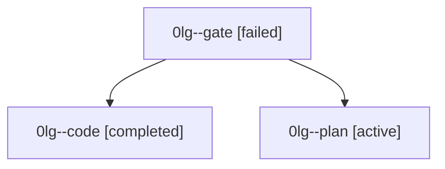

# Family: 0lg

[Agent Hoods](../README.md) / [bbugyi200](../users/bbugyi200/README.md) / [athena](../users/bbugyi200/machines/athena/README.md) / [0lg](../users/bbugyi200/machines/athena/hoods/0lg/README.md) / 0lg

Owner: `bbugyi200.athena` · Hood: `0lg` · Members: 3

## Lineage

The diagram is an optional enhancement; the ordered table below contains the same lineage in accessible text.

| Role | Agent | State | Model / provider | Timing | Commits | Prompt | Chat |
|---|---|---|---|---|---:|---|---|
| gate | 0lg--gate | failed | claude-fable-5 / claude | 2026-09-15T18:41:46.143805+00:00 → 2026-09-15T18:42:38.728163+00:00 | 0 | — | [Chat](../agents/bbugyi200.athena.0lg--gate/chat.md) |
| code | 0lg--code | completed | gpt-5.5 / codex | 2026-09-15T18:43:08.609560+00:00 → 2026-09-15T18:59:44.601067+00:00 | [1](../agents/bbugyi200.athena.0lg--code/README.md#commits) | [Prompt](../agents/bbugyi200.athena.0lg--code/prompt.md) | [Chat](../agents/bbugyi200.athena.0lg--code/chat.md) |
| plan | 0lg--plan | active | claude-fable-5 / claude | 2026-09-15T18:28:49.676050+00:00 | 0 | [Prompt](../agents/bbugyi200.athena.0lg--plan/prompt.md) | [Chat](../agents/bbugyi200.athena.0lg--plan/chat.md) |

## Commits

| Role | Repo | Commit | Subject | Committed |
|---|---|---|---|---|
| code | sase | [`bdda3bd`](https://github.com/sase-org/sase/commit/bdda3bdf12f1b14627c9913534e4da87549b5048) | fix(claude): guard background wait replies | 2026-09-15 14:59:04 EDT |
