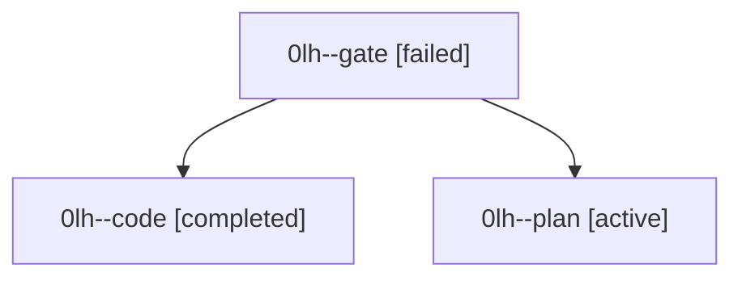

# Family: 0lh

[Agent Hoods](../README.md) / [bbugyi200](../users/bbugyi200/README.md) / [athena](../users/bbugyi200/machines/athena/README.md) / [0lh](../users/bbugyi200/machines/athena/hoods/0lh/README.md) / 0lh

Owner: `bbugyi200.athena` · Hood: `0lh` · Members: 3

## Lineage

The diagram is an optional enhancement; the ordered table below contains the same lineage in accessible text.

| Role | Agent | State | Model / provider | Timing | Commits | Prompt | Chat |
|---|---|---|---|---|---:|---|---|
| gate | 0lh--gate | failed | gpt-6-astra / codex | 2026-09-15T18:51:22.424768+00:00 → 2026-09-15T18:52:20.737037+00:00 | 0 | — | [Chat](../agents/bbugyi200.athena.0lh--gate/chat.md) |
| code | 0lh--code | completed | gpt-5.5 / codex | 2026-09-15T18:52:49.366840+00:00 → 2026-09-15T19:51:57.716478+00:00 | [1](../agents/bbugyi200.athena.0lh--code/README.md#commits) | [Prompt](../agents/bbugyi200.athena.0lh--code/prompt.md) | [Chat](../agents/bbugyi200.athena.0lh--code/chat.md) |
| plan | 0lh--plan | active | gpt-6-astra / codex | 2026-09-15T18:45:15.406999+00:00 | 0 | [Prompt](../agents/bbugyi200.athena.0lh--plan/prompt.md) | [Chat](../agents/bbugyi200.athena.0lh--plan/chat.md) |

## Commits

| Role | Repo | Commit | Subject | Committed |
|---|---|---|---|---|
| code | sase | [`47def62`](https://github.com/sase-org/sase/commit/47def629305dda1df53be14a1b64589b24b2ea4e) | feat(init): remember reviewed machine init candidates | 2026-09-15 15:46:45 EDT |
