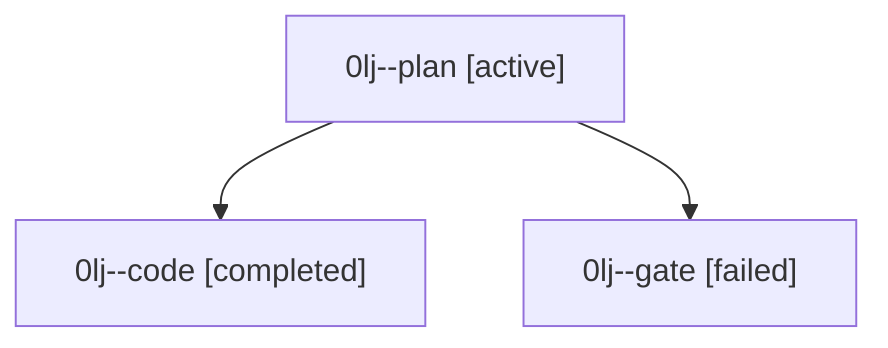

# Family: 0lj

[Agent Hoods](../README.md) / [bbugyi200](../users/bbugyi200/README.md) / [athena](../users/bbugyi200/machines/athena/README.md) / [0lj](../users/bbugyi200/machines/athena/hoods/0lj/README.md) / 0lj

Owner: `bbugyi200.athena` · Hood: `0lj` · Members: 3

## Lineage

The diagram is an optional enhancement; the ordered table below contains the same lineage in accessible text.

| Role | Agent | State | Model / provider | Timing | Commits | Prompt | Chat |
|---|---|---|---|---|---:|---|---|
| plan | 0lj--plan | active | claude-fable-5 / claude | 2026-09-15T20:08:05.561432+00:00 | 0 | [Prompt](../agents/bbugyi200.athena.0lj--plan/prompt.md) | [Chat](../agents/bbugyi200.athena.0lj--plan/chat.md) |
| code | 0lj--code | completed | gpt-5.5 / codex | 2026-09-15T20:24:44.091844+00:00 → 2026-09-15T20:59:51.416236+00:00 | [1](../agents/bbugyi200.athena.0lj--code/README.md#commits) | [Prompt](../agents/bbugyi200.athena.0lj--code/prompt.md) | [Chat](../agents/bbugyi200.athena.0lj--code/chat.md) |
| gate | 0lj--gate | failed | claude-fable-5 / claude | 2026-09-15T20:23:32.082110+00:00 → 2026-09-15T20:24:21.953550+00:00 | 0 | — | [Chat](../agents/bbugyi200.athena.0lj--gate/chat.md) |

## Commits

| Role | Repo | Commit | Subject | Committed |
|---|---|---|---|---|
| code | sase | [`61febdc`](https://github.com/sase-org/sase/commit/61febdcc686eed8d82e9a4a1d9069745a512cfb8) | fix(monitor): propagate auto approval to followups | 2026-09-15 16:59:04 EDT |
