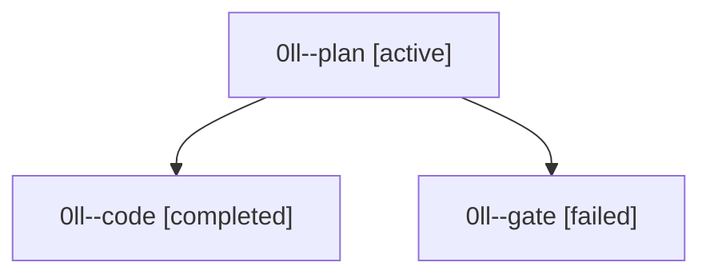

# Family: 0ll

[Agent Hoods](../README.md) / [bbugyi200](../users/bbugyi200/README.md) / [athena](../users/bbugyi200/machines/athena/README.md) / [0ll](../users/bbugyi200/machines/athena/hoods/0ll/README.md) / 0ll

Owner: `bbugyi200.athena` · Hood: `0ll` · Members: 3

## Lineage

The diagram is an optional enhancement; the ordered table below contains the same lineage in accessible text.

| Role | Agent | State | Model / provider | Timing | Commits | Prompt | Chat |
|---|---|---|---|---|---:|---|---|
| plan | 0ll--plan | active | gpt-6-astra / codex | 2026-09-15T22:11:47.062406+00:00 | 0 | [Prompt](../agents/bbugyi200.athena.0ll--plan/prompt.md) | [Chat](../agents/bbugyi200.athena.0ll--plan/chat.md) |
| code | 0ll--code | completed | gpt-5.5 / codex | 2026-09-15T22:22:13.963183+00:00 → 2026-09-15T23:23:55.573016+00:00 | [1](../agents/bbugyi200.athena.0ll--code/README.md#commits) | [Prompt](../agents/bbugyi200.athena.0ll--code/prompt.md) | [Chat](../agents/bbugyi200.athena.0ll--code/chat.md) |
| gate | 0ll--gate | failed | gpt-6-astra / codex | 2026-09-15T22:21:07.235518+00:00 → 2026-09-15T22:21:52.618345+00:00 | 0 | — | [Chat](../agents/bbugyi200.athena.0ll--gate/chat.md) |

## Commits

| Role | Repo | Commit | Subject | Committed |
|---|---|---|---|---|
| code | sase | [`b2d7af0`](https://github.com/sase-org/sase/commit/b2d7af01a77c9dd0a7e99b8fc279abf63ca10ed6) | feat: support double-colon prompt argument pairing | 2026-09-15 19:17:45 EDT |
