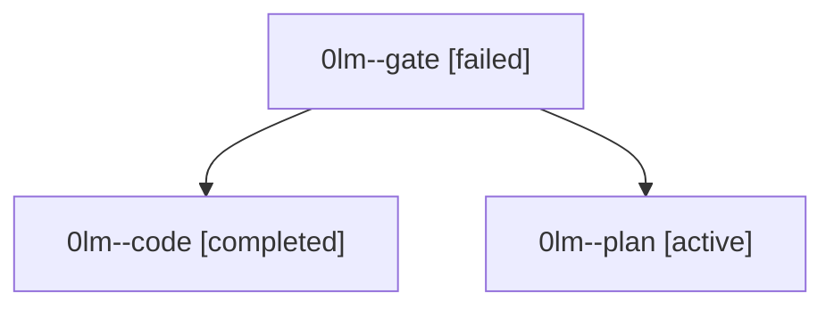

# Family: 0lm

[Agent Hoods](../README.md) / [bbugyi200](../users/bbugyi200/README.md) / [athena](../users/bbugyi200/machines/athena/README.md) / [0lm](../users/bbugyi200/machines/athena/hoods/0lm/README.md) / 0lm

Owner: `bbugyi200.athena` · Hood: `0lm` · Members: 3

## Lineage

The diagram is an optional enhancement; the ordered table below contains the same lineage in accessible text.

| Role | Agent | State | Model / provider | Timing | Commits | Prompt | Chat |
|---|---|---|---|---|---:|---|---|
| gate | 0lm--gate | failed | gpt-6-astra / codex | 2026-09-15T23:10:12.508803+00:00 → 2026-09-15T23:11:09.055905+00:00 | 0 | — | [Chat](../agents/bbugyi200.athena.0lm--gate/chat.md) |
| code | 0lm--code | completed | gpt-5.5 / codex | 2026-09-15T23:11:34.568898+00:00 → 2026-09-16T01:27:17.939626+00:00 | [1](../agents/bbugyi200.athena.0lm--code/README.md#commits) | [Prompt](../agents/bbugyi200.athena.0lm--code/prompt.md) | [Chat](../agents/bbugyi200.athena.0lm--code/chat.md) |
| plan | 0lm--plan | active | gpt-6-astra / codex | 2026-09-15T22:48:11.059232+00:00 | 0 | [Prompt](../agents/bbugyi200.athena.0lm--plan/prompt.md) | [Chat](../agents/bbugyi200.athena.0lm--plan/chat.md) |

## Commits

| Role | Repo | Commit | Subject | Committed |
|---|---|---|---|---|
| code | sase | [`d4b4099`](https://github.com/sase-org/sase/commit/d4b409921ebbcdbd412610f28fe7952309ddb081) | feat(xprompt): support static conditional launch segments | 2026-09-15 21:19:40 EDT |
