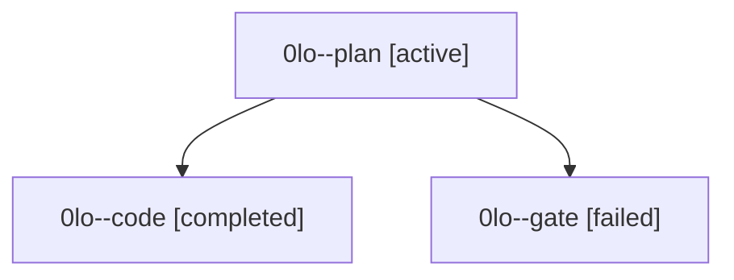

# Family: 0lo

[Agent Hoods](../README.md) / [bbugyi200](../users/bbugyi200/README.md) / [athena](../users/bbugyi200/machines/athena/README.md) / [0lo](../users/bbugyi200/machines/athena/hoods/0lo/README.md) / 0lo

Owner: `bbugyi200.athena` · Hood: `0lo` · Members: 3

## Lineage

The diagram is an optional enhancement; the ordered table below contains the same lineage in accessible text.

| Role | Agent | State | Model / provider | Timing | Commits | Prompt | Chat |
|---|---|---|---|---|---:|---|---|
| plan | 0lo--plan | active | claude-fable-5 / claude | 2026-09-16T00:22:27.890677+00:00 | 0 | [Prompt](../agents/bbugyi200.athena.0lo--plan/prompt.md) | [Chat](../agents/bbugyi200.athena.0lo--plan/chat.md) |
| code | 0lo--code | completed | gpt-5.5 / codex | 2026-09-16T01:09:52.323354+00:00 → 2026-09-16T01:42:41.271418+00:00 | [1](../agents/bbugyi200.athena.0lo--code/README.md#commits) | [Prompt](../agents/bbugyi200.athena.0lo--code/prompt.md) | [Chat](../agents/bbugyi200.athena.0lo--code/chat.md) |
| gate | 0lo--gate | failed | claude-fable-5 / claude | 2026-09-16T01:08:19.220687+00:00 → 2026-09-16T01:09:27.063226+00:00 | 0 | — | [Chat](../agents/bbugyi200.athena.0lo--gate/chat.md) |

## Commits

| Role | Repo | Commit | Subject | Committed |
|---|---|---|---|---|
| code | sase | [`ea358da`](https://github.com/sase-org/sase/commit/ea358dace46d347ac6b1b25d0d2a7100142dc96e) | fix(tui): merge settled shell rows over stale cache | 2026-09-15 21:42:00 EDT |
