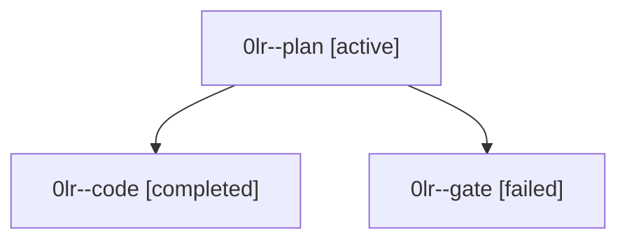

# Family: 0lr

[Agent Hoods](../README.md) / [bbugyi200](../users/bbugyi200/README.md) / [athena](../users/bbugyi200/machines/athena/README.md) / [0lr](../users/bbugyi200/machines/athena/hoods/0lr/README.md) / 0lr

Owner: `bbugyi200.athena` · Hood: `0lr` · Members: 3

## Lineage

The diagram is an optional enhancement; the ordered table below contains the same lineage in accessible text.

| Role | Agent | State | Model / provider | Timing | Commits | Prompt | Chat |
|---|---|---|---|---|---:|---|---|
| plan | 0lr--plan | active | opus / claude | 2026-09-16T01:37:30.511765+00:00 | 0 | [Prompt](../agents/bbugyi200.athena.0lr--plan/prompt.md) | [Chat](../agents/bbugyi200.athena.0lr--plan/chat.md) |
| code | 0lr--code | completed | gpt-5.5 / codex | 2026-09-16T02:09:25.315962+00:00 → 2026-09-16T03:17:47.245493+00:00 | [1](../agents/bbugyi200.athena.0lr--code/README.md#commits) | [Prompt](../agents/bbugyi200.athena.0lr--code/prompt.md) | [Chat](../agents/bbugyi200.athena.0lr--code/chat.md) |
| gate | 0lr--gate | failed | opus / claude | 2026-09-16T02:08:07.096725+00:00 → 2026-09-16T02:08:59.775027+00:00 | 0 | — | [Chat](../agents/bbugyi200.athena.0lr--gate/chat.md) |

## Commits

| Role | Repo | Commit | Subject | Committed |
|---|---|---|---|---|
| code | sase | [`a98b96e`](https://github.com/sase-org/sase/commit/a98b96e510fc601cb2cbf9b9d5538bed07120de0) | feat(tui): add xprompt keyword arg completion | 2026-09-15 23:15:16 EDT |
