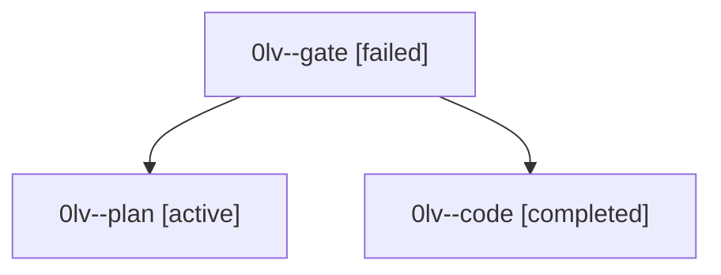

# Family: 0lv

[Agent Hoods](../README.md) / [bbugyi200](../users/bbugyi200/README.md) / [athena](../users/bbugyi200/machines/athena/README.md) / [0lv](../users/bbugyi200/machines/athena/hoods/0lv/README.md) / 0lv

Owner: `bbugyi200.athena` · Hood: `0lv` · Members: 3

## Lineage

The diagram is an optional enhancement; the ordered table below contains the same lineage in accessible text.

| Role | Agent | State | Model / provider | Timing | Commits | Prompt | Chat |
|---|---|---|---|---|---:|---|---|
| gate | 0lv--gate | failed | gpt-5.6-sol / codex | 2026-09-16T13:04:52.341222+00:00 → 2026-09-16T13:05:46.334989+00:00 | 0 | — | [Chat](../agents/bbugyi200.athena.0lv--gate/chat.md) |
| plan | 0lv--plan | active | gpt-5.6-sol / codex | 2026-09-16T12:59:32.111073+00:00 | 0 | [Prompt](../agents/bbugyi200.athena.0lv--plan/prompt.md) | [Chat](../agents/bbugyi200.athena.0lv--plan/chat.md) |
| code | 0lv--code | completed | gpt-5.5 / codex | 2026-09-16T13:06:03.437412+00:00 → 2026-09-16T13:16:28.652637+00:00 | 0 | [Prompt](../agents/bbugyi200.athena.0lv--code/prompt.md) | [Chat](../agents/bbugyi200.athena.0lv--code/chat.md) |

## Neighbors

| Agent | Relation | State |
|---|---|---|
| [0lv.w0](bbugyi200.athena.0lv.w0.md) (family · 3) | descendant | active 1, completed 1, failed 1 |
