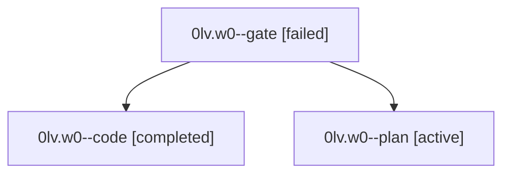

# Family: 0lv.w0

[Agent Hoods](../README.md) / [bbugyi200](../users/bbugyi200/README.md) / [athena](../users/bbugyi200/machines/athena/README.md) / [0lv](../users/bbugyi200/machines/athena/hoods/0lv/README.md) / 0lv.w0

Owner: `bbugyi200.athena` · Hood: `0lv` · Members: 3

## Lineage

The diagram is an optional enhancement; the ordered table below contains the same lineage in accessible text.

| Role | Agent | State | Model / provider | Timing | Commits | Prompt | Chat |
|---|---|---|---|---|---:|---|---|
| gate | 0lv.w0--gate | failed | claude-fable-5 / claude | 2026-09-16T13:43:56.635813+00:00 → 2026-09-16T13:45:02.618976+00:00 | 0 | — | [Chat](../agents/bbugyi200.athena.0lv.w0--gate/chat.md) |
| code | 0lv.w0--code | completed | gpt-5.5 / codex | 2026-09-16T13:45:23.825297+00:00 → 2026-09-16T14:09:10.672364+00:00 | [1](../agents/bbugyi200.athena.0lv.w0--code/README.md#commits) | [Prompt](../agents/bbugyi200.athena.0lv.w0--code/prompt.md) | [Chat](../agents/bbugyi200.athena.0lv.w0--code/chat.md) |
| plan | 0lv.w0--plan | active | claude-fable-5 / claude | 2026-09-16T13:16:22.996012+00:00 | 0 | [Prompt](../agents/bbugyi200.athena.0lv.w0--plan/prompt.md) | [Chat](../agents/bbugyi200.athena.0lv.w0--plan/chat.md) |

## Commits

| Role | Repo | Commit | Subject | Committed |
|---|---|---|---|---|
| code | sase | [`64b87df`](https://github.com/sase-org/sase/commit/64b87df9ce48e69689bbb9d78bdb2ce185152b4e) | fix(core): ratchet sase-core revision pin | 2026-09-16 10:06:52 EDT |

## Neighbors

| Agent | Relation | State |
|---|---|---|
| [0lv](bbugyi200.athena.0lv.md) (family · 3) | ancestor | active 1, completed 1, failed 1 |
