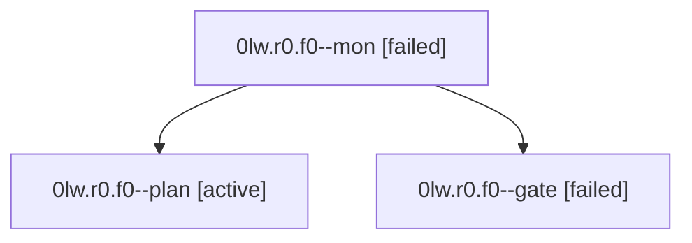

# Family: 0lw.r0.f0

[Agent Hoods](../README.md) / [bbugyi200](../users/bbugyi200/README.md) / [athena](../users/bbugyi200/machines/athena/README.md) / [0lw](../users/bbugyi200/machines/athena/hoods/0lw/README.md) / 0lw.r0.f0

Owner: `bbugyi200.athena` · Hood: `0lw` · Members: 3

## Lineage

The diagram is an optional enhancement; the ordered table below contains the same lineage in accessible text.

| Role | Agent | State | Model / provider | Timing | Commits | Prompt | Chat |
|---|---|---|---|---|---:|---|---|
| mon | 0lw.r0.f0--mon | failed | claude-fable-5 / claude | 2026-09-16T14:41:53.001156+00:00 → 2026-09-16T14:44:20.049370+00:00 | 0 | — | [Chat](../agents/bbugyi200.athena.0lw.r0.f0--mon/chat.md) |
| plan | 0lw.r0.f0--plan | active | claude-fable-5 / claude | 2026-09-16T14:08:57.935692+00:00 | 0 | [Prompt](../agents/bbugyi200.athena.0lw.r0.f0--plan/prompt.md) | [Chat](../agents/bbugyi200.athena.0lw.r0.f0--plan/chat.md) |
| gate | 0lw.r0.f0--gate | failed | claude-fable-5 / claude | 2026-09-16T14:40:59.650137+00:00 → 2026-09-16T14:42:03.474066+00:00 | 0 | — | [Chat](../agents/bbugyi200.athena.0lw.r0.f0--gate/chat.md) |

## Neighbors

| Agent | Relation | State |
|---|---|---|
| [0lw.r0](bbugyi200.athena.0lw.r0.md) (family · 1) | ancestor | active 1 |
| [0lw](../agents/bbugyi200.athena.0lw/README.md) | ancestor | active |
