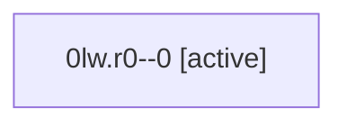

# Family: 0lw.r0

[Agent Hoods](../README.md) / [bbugyi200](../users/bbugyi200/README.md) / [athena](../users/bbugyi200/machines/athena/README.md) / [0lw](../users/bbugyi200/machines/athena/hoods/0lw/README.md) / 0lw.r0

Owner: `bbugyi200.athena` · Hood: `0lw` · Members: 1

## Lineage

The diagram is an optional enhancement; the ordered table below contains the same lineage in accessible text.

| Role | Agent | State | Model / provider | Timing | Commits | Prompt | Chat |
|---|---|---|---|---|---:|---|---|
| 0 | 0lw.r0--0 | active | gpt-5.6-sol / codex | 2026-09-16T14:03:51.543321+00:00 | 0 | [Prompt](../agents/bbugyi200.athena.0lw.r0--0/prompt.md) | [Chat](../agents/bbugyi200.athena.0lw.r0--0/chat.md) |

## Neighbors

| Agent | Relation | State |
|---|---|---|
| [0lw](../agents/bbugyi200.athena.0lw/README.md) | ancestor | active |
| [0lw.r0.f0](bbugyi200.athena.0lw.r0.f0.md) (family · 3) | descendant | active 1, failed 2 |
