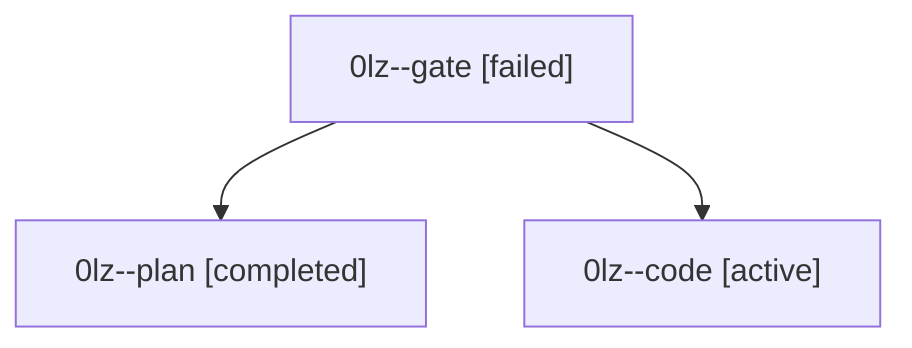

# Family: 0lz

[Agent Hoods](../README.md) / [bbugyi200](../users/bbugyi200/README.md) / [athena](../users/bbugyi200/machines/athena/README.md) / [0lz](../users/bbugyi200/machines/athena/hoods/0lz/README.md) / 0lz

Owner: `bbugyi200.athena` · Hood: `0lz` · Members: 3

## Lineage

The diagram is an optional enhancement; the ordered table below contains the same lineage in accessible text.

| Role | Agent | State | Model / provider | Timing | Commits | Prompt | Chat |
|---|---|---|---|---|---:|---|---|
| gate | 0lz--gate | failed | opus / claude | 2026-09-16T16:16:35.630684+00:00 → 2026-09-16T16:17:38.962107+00:00 | 0 | — | [Chat](../agents/bbugyi200.athena.0lz--gate/chat.md) |
| plan | 0lz--plan | completed | opus / claude | 2026-09-16T15:59:00.263210+00:00 → 2026-09-16T16:11:55.959872+00:00 | 0 | [Prompt](../agents/bbugyi200.athena.0lz--plan/prompt.md) | [Chat](../agents/bbugyi200.athena.0lz--plan/chat.md) |
| code | 0lz--code | active | gpt-5.5 / codex | 2026-09-16T16:18:14.148489+00:00 | [1](../agents/bbugyi200.athena.0lz--code/README.md#commits) | [Prompt](../agents/bbugyi200.athena.0lz--code/prompt.md) | — |

## Commits

| Role | Repo | Commit | Subject | Committed |
|---|---|---|---|---|
| code | sase | [`7636fe0`](https://github.com/sase-org/sase/commit/7636fe03b8c3960653e9ddc7494f52203c9c81c8) | feat(tui): show prompt search match counts | 2026-09-16 13:13:49 EDT |
