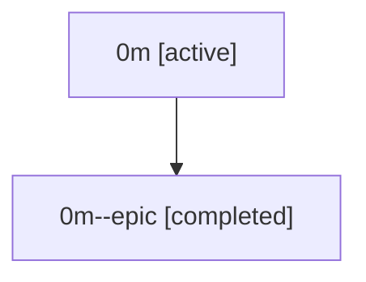

# Family: 0m

[Agent Hoods](../README.md) / [bbugyi200](../users/bbugyi200/README.md) / [athena](../users/bbugyi200/machines/athena/README.md) / [0m](../users/bbugyi200/machines/athena/hoods/0m/README.md) / 0m

Owner: `bbugyi200.athena` · Hood: `0m` · Members: 2

## Lineage

The diagram is an optional enhancement; the ordered table below contains the same lineage in accessible text.

| Role | Agent | State | Model / provider | Timing | Commits | Prompt | Chat |
|---|---|---|---|---|---:|---|---|
| root | 0m | active | claude-fable-5 / claude | 2026-07-07T16:54:46.644187+00:00 | [1](../agents/bbugyi200.athena.0m/README.md#commits) | [Prompt](../agents/bbugyi200.athena.0m/prompt.md) | [Chat](../agents/bbugyi200.athena.0m/chat.md) |
| epic | 0m--epic | completed | gpt-5.5 / codex | 2026-07-07T17:10:34.763848+00:00 | [1](../agents/bbugyi200.athena.0m--epic/README.md#commits) | — | [Chat](../agents/bbugyi200.athena.0m--epic/chat.md) |

## Commits

| Role | Repo | Commit | Subject | Committed |
|---|---|---|---|---|
| root | sase | [`bee58b4`](https://github.com/sase-org/sase/commit/bee58b411bce355c5c36689aefe2833b34fa2b34) | chore: Add SDD prompt and plan for vcs\_repo\_slash\_completion | 2026-07-07 17:10:33 UTC |
| epic | sase | [`cb5f4cf`](https://github.com/sase-org/sase/commit/cb5f4cf229a7b4a65d0dbc4d42dfffae9914e40b) | chore(beads): create VCS repo completion epic | 2026-07-07 17:20:20 UTC |
