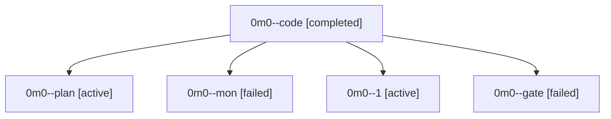

# Family: 0m0

[Agent Hoods](../README.md) / [bbugyi200](../users/bbugyi200/README.md) / [athena](../users/bbugyi200/machines/athena/README.md) / [0m0](../users/bbugyi200/machines/athena/hoods/0m0/README.md) / 0m0

Owner: `bbugyi200.athena` · Hood: `0m0` · Members: 5

## Lineage

The diagram is an optional enhancement; the ordered table below contains the same lineage in accessible text.

| Role | Agent | State | Model / provider | Timing | Commits | Prompt | Chat |
|---|---|---|---|---|---:|---|---|
| code | 0m0--code | completed | sonnet / claude | 2026-09-16T17:15:21.235275+00:00 → 2026-09-16T18:47:27.277166+00:00 | 0 | [Prompt](../agents/bbugyi200.athena.0m0--code/prompt.md) | [Chat](../agents/bbugyi200.athena.0m0--code/chat.md) |
| plan | 0m0--plan | active | gpt-6-astra / codex | 2026-09-16T17:03:41.045527+00:00 | 0 | [Prompt](../agents/bbugyi200.athena.0m0--plan/prompt.md) | [Chat](../agents/bbugyi200.athena.0m0--plan/chat.md) |
| mon | 0m0--mon | failed | sonnet / claude | 2026-09-16T18:46:34.092259+00:00 → 2026-09-16T18:55:55.448689+00:00 | 0 | — | [Chat](../agents/bbugyi200.athena.0m0--mon/chat.md) |
| 1 | 0m0--1 | active | sonnet / claude | 2026-09-16T19:04:19.546896+00:00 | [1](../agents/bbugyi200.athena.0m0--1/README.md#commits) | [Prompt](../agents/bbugyi200.athena.0m0--1/prompt.md) | — |
| gate | 0m0--gate | failed | gpt-6-astra / codex | 2026-09-16T17:13:45.442126+00:00 → 2026-09-16T17:14:45.800916+00:00 | 0 | — | [Chat](../agents/bbugyi200.athena.0m0--gate/chat.md) |

## Commits

| Role | Repo | Commit | Subject | Committed |
|---|---|---|---|---|
| 1 | sase | [`89b2443`](https://github.com/sase-org/sase/commit/89b2443948438463976c6182ef7f7d897c8dfb1e) | fix(gates): make gate-shell reclaim receipt-aware | 2026-09-16 15:11:30 EDT |
