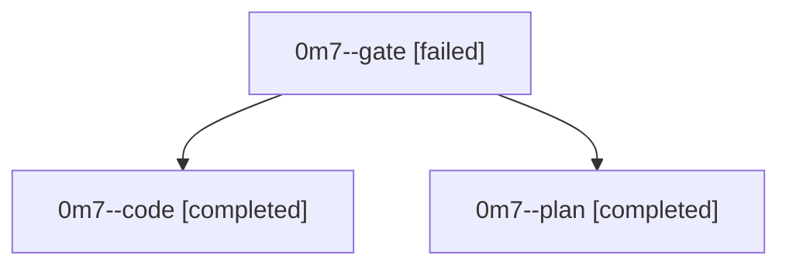

# Family: 0m7

[Agent Hoods](../README.md) / [bbugyi200](../users/bbugyi200/README.md) / [athena](../users/bbugyi200/machines/athena/README.md) / [0m7](../users/bbugyi200/machines/athena/hoods/0m7/README.md) / 0m7

Owner: `bbugyi200.athena` · Hood: `0m7` · Members: 3

## Lineage

The diagram is an optional enhancement; the ordered table below contains the same lineage in accessible text.

| Role | Agent | State | Model / provider | Timing | Commits | Prompt | Chat |
|---|---|---|---|---|---:|---|---|
| gate | 0m7--gate | failed | claude-fable-5 / claude | 2026-09-17T12:42:19.256889+00:00 → 2026-09-17T12:43:07.240671+00:00 | 0 | — | [Chat](../agents/bbugyi200.athena.0m7--gate/chat.md) |
| code | 0m7--code | completed | gpt-5.5 / codex | 2026-09-17T12:43:30.447482+00:00 → 2026-09-17T13:41:53.095775+00:00 | [1](../agents/bbugyi200.athena.0m7--code/README.md#commits) | [Prompt](../agents/bbugyi200.athena.0m7--code/prompt.md) | [Chat](../agents/bbugyi200.athena.0m7--code/chat.md) |
| plan | 0m7--plan | completed | claude-fable-5 / claude | 2026-09-17T12:19:58.889314+00:00 → 2026-09-17T12:42:03.098327+00:00 | 0 | [Prompt](../agents/bbugyi200.athena.0m7--plan/prompt.md) | [Chat](../agents/bbugyi200.athena.0m7--plan/chat.md) |

## Commits

| Role | Repo | Commit | Subject | Committed |
|---|---|---|---|---|
| code | sase | [`cc2cf78`](https://github.com/sase-org/sase/commit/cc2cf78a044e361bbd251ffbfa36603fb63f9023) | fix(sdd): write machine bead links via hidden clone | 2026-09-17 09:38:31 EDT |
