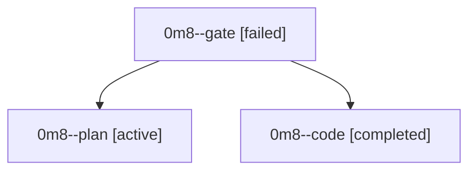

# Family: 0m8

[Agent Hoods](../README.md) / [bbugyi200](../users/bbugyi200/README.md) / [athena](../users/bbugyi200/machines/athena/README.md) / [0m8](../users/bbugyi200/machines/athena/hoods/0m8/README.md) / 0m8

Owner: `bbugyi200.athena` · Hood: `0m8` · Members: 3

## Lineage

The diagram is an optional enhancement; the ordered table below contains the same lineage in accessible text.

| Role | Agent | State | Model / provider | Timing | Commits | Prompt | Chat |
|---|---|---|---|---|---:|---|---|
| gate | 0m8--gate | failed | gpt-6-astra / codex | 2026-09-17T12:38:30.975595+00:00 → 2026-09-17T12:39:09.791137+00:00 | 0 | — | [Chat](../agents/bbugyi200.athena.0m8--gate/chat.md) |
| plan | 0m8--plan | active | gpt-6-astra / codex | 2026-09-17T12:23:28.935839+00:00 | 0 | [Prompt](../agents/bbugyi200.athena.0m8--plan/prompt.md) | [Chat](../agents/bbugyi200.athena.0m8--plan/chat.md) |
| code | 0m8--code | completed | gpt-5.5 / codex | 2026-09-17T12:39:33.422248+00:00 → 2026-09-17T13:58:22.334232+00:00 | [1](../agents/bbugyi200.athena.0m8--code/README.md#commits) | [Prompt](../agents/bbugyi200.athena.0m8--code/prompt.md) | [Chat](../agents/bbugyi200.athena.0m8--code/chat.md) |

## Commits

| Role | Repo | Commit | Subject | Committed |
|---|---|---|---|---|
| code | sase | [`3ef40e9`](https://github.com/sase-org/sase/commit/3ef40e9155d64ede21c508a78d44f12616320a7c) | test: cover Claude Fable usage identity | 2026-09-17 09:53:27 EDT |
