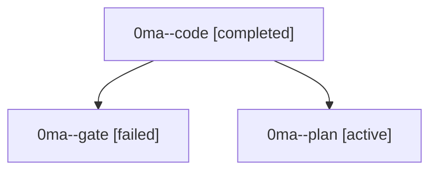

# Family: 0ma

[Agent Hoods](../README.md) / [bbugyi200](../users/bbugyi200/README.md) / [athena](../users/bbugyi200/machines/athena/README.md) / [0ma](../users/bbugyi200/machines/athena/hoods/0ma/README.md) / 0ma

Owner: `bbugyi200.athena` · Hood: `0ma` · Members: 3

## Lineage

The diagram is an optional enhancement; the ordered table below contains the same lineage in accessible text.

| Role | Agent | State | Model / provider | Timing | Commits | Prompt | Chat |
|---|---|---|---|---|---:|---|---|
| code | 0ma--code | completed | gpt-5.5 / codex | 2026-09-17T14:13:41.893375+00:00 → 2026-09-17T16:38:49.235080+00:00 | [1](../agents/bbugyi200.athena.0ma--code/README.md#commits) | [Prompt](../agents/bbugyi200.athena.0ma--code/prompt.md) | [Chat](../agents/bbugyi200.athena.0ma--code/chat.md) |
| gate | 0ma--gate | failed | gpt-6-astra / codex | 2026-09-17T14:04:33.060647+00:00 → 2026-09-17T14:06:09.520695+00:00 | 0 | — | [Chat](../agents/bbugyi200.athena.0ma--gate/chat.md) |
| plan | 0ma--plan | active | gpt-6-astra / codex | 2026-09-17T13:58:22.391250+00:00 | 0 | [Prompt](../agents/bbugyi200.athena.0ma--plan/prompt.md) | [Chat](../agents/bbugyi200.athena.0ma--plan/chat.md) |

## Commits

| Role | Repo | Commit | Subject | Committed |
|---|---|---|---|---|
| code | sase | [`7b7b753`](https://github.com/sase-org/sase/commit/7b7b753405c0b389c06365ea2c24da9a63c42bda) | fix(repo): redirect external refs to linked checkouts | 2026-09-17 12:23:46 EDT |
