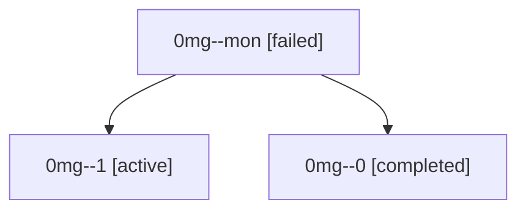

# Family: 0mg

[Agent Hoods](../README.md) / [bbugyi200](../users/bbugyi200/README.md) / [athena](../users/bbugyi200/machines/athena/README.md) / [0mg](../users/bbugyi200/machines/athena/hoods/0mg/README.md) / 0mg

Owner: `bbugyi200.athena` · Hood: `0mg` · Members: 3

## Lineage

The diagram is an optional enhancement; the ordered table below contains the same lineage in accessible text.

| Role | Agent | State | Model / provider | Timing | Commits | Prompt | Chat |
|---|---|---|---|---|---:|---|---|
| mon | 0mg--mon | failed | gpt-5.5 / codex | 2026-09-17T17:46:35.711971+00:00 → 2026-09-17T17:58:01.475706+00:00 | 0 | — | [Chat](../agents/bbugyi200.athena.0mg--mon/chat.md) |
| 1 | 0mg--1 | active | gpt-5.5 / codex | 2026-09-17T17:58:24.114174+00:00 | [1](../agents/bbugyi200.athena.0mg--1/README.md#commits) | [Prompt](../agents/bbugyi200.athena.0mg--1/prompt.md) | — |
| 0 | 0mg--0 | completed | gpt-5.5 / codex | 2026-09-17T17:07:59.067944+00:00 → 2026-09-17T17:47:31.186554+00:00 | 0 | [Prompt](../agents/bbugyi200.athena.0mg--0/prompt.md) | [Chat](../agents/bbugyi200.athena.0mg--0/chat.md) |

## Commits

| Role | Repo | Commit | Subject | Committed |
|---|---|---|---|---|
| 1 | sase | [`15c094c`](https://github.com/sase-org/sase/commit/15c094c6fa172d359cb25588a7a9d0ca71f34be9) | fix(tui): align usage indicator color buckets | 2026-09-17 14:00:19 EDT |
