# Family: 0mi

[Agent Hoods](../README.md) / [bbugyi200](../users/bbugyi200/README.md) / [athena](../users/bbugyi200/machines/athena/README.md) / [0mi](../users/bbugyi200/machines/athena/hoods/0mi/README.md) / 0mi

Owner: `bbugyi200.athena` · Hood: `0mi` · Members: 19

## Lineage

```mermaid
flowchart TD
  n0["0mi--mon-2 [failed]"]
  n1["0mi--mon-3 [failed]"]
  n0 --> n1
  n2["0mi--2 [completed]"]
  n0 --> n2
  n3["0mi--mon-5 [failed]"]
  n0 --> n3
  n4["0mi--5 [completed]"]
  n0 --> n4
  n5["0mi--mon-6 [failed]"]
  n0 --> n5
  n6["0mi--7 [completed]"]
  n0 --> n6
  n7["0mi--4 [completed]"]
  n0 --> n7
  n8["0mi--code [completed]"]
  n0 --> n8
  n9["0mi--mon [failed]"]
  n0 --> n9
  n10["0mi--6 [completed]"]
  n0 --> n10
  n11["0mi--plan [completed]"]
  n0 --> n11
  n12["0mi--1 [completed]"]
  n0 --> n12
  n13["0mi--3 [completed]"]
  n0 --> n13
  n14["0mi--mon-0 [failed]"]
  n0 --> n14
  n15["0mi--8 [completed]"]
  n0 --> n15
  n16["0mi--gate [failed]"]
  n0 --> n16
  n17["0mi--mon-1 [failed]"]
  n0 --> n17
  n18["0mi--mon-4 [failed]"]
  n0 --> n18
```

The diagram is an optional enhancement; the ordered table below contains the same lineage in accessible text.

| Role | Agent | State | Model / provider | Timing | Commits | Prompt | Chat |
|---|---|---|---|---|---:|---|---|
| mon-2 | 0mi--mon-2 | failed | gpt-5.5 / codex | 2026-09-18T03:40:54.253534+00:00 → 2026-09-18T04:11:45.296940+00:00 | 0 | — | [Chat](../agents/bbugyi200.athena.0mi--mon-2/chat.md) |
| mon-3 | 0mi--mon-3 | failed | gpt-5.5 / codex | 2026-09-18T04:15:45.729447+00:00 → 2026-09-18T04:33:33.137155+00:00 | 0 | — | [Chat](../agents/bbugyi200.athena.0mi--mon-3/chat.md) |
| 2 | 0mi--2 | completed | gpt-5.5 / codex | 2026-09-18T00:25:23.857664+00:00 → 2026-09-18T00:27:27.444130+00:00 | 0 | [Prompt](../agents/bbugyi200.athena.0mi--2/prompt.md) | [Chat](../agents/bbugyi200.athena.0mi--2/chat.md) |
| mon-5 | 0mi--mon-5 | failed | gpt-5.5 / codex | 2026-09-18T05:30:31.031443+00:00 → 2026-09-18T05:49:19.793542+00:00 | 0 | — | [Chat](../agents/bbugyi200.athena.0mi--mon-5/chat.md) |
| 5 | 0mi--5 | completed | gpt-5.5 / codex | 2026-09-18T04:33:33.077186+00:00 → 2026-09-18T04:35:42.371716+00:00 | 0 | [Prompt](../agents/bbugyi200.athena.0mi--5/prompt.md) | [Chat](../agents/bbugyi200.athena.0mi--5/chat.md) |
| mon-6 | 0mi--mon-6 | failed | gpt-5.5 / codex | 2026-09-18T05:51:14.386957+00:00 → 2026-09-18T06:59:27.858785+00:00 | 0 | — | [Chat](../agents/bbugyi200.athena.0mi--mon-6/chat.md) |
| 7 | 0mi--7 | completed | gpt-5.5 / codex | 2026-09-18T05:49:19.355421+00:00 → 2026-09-18T05:51:47.576558+00:00 | 0 | [Prompt](../agents/bbugyi200.athena.0mi--7/prompt.md) | [Chat](../agents/bbugyi200.athena.0mi--7/chat.md) |
| 4 | 0mi--4 | completed | gpt-5.5 / codex | 2026-09-18T04:11:44.978664+00:00 → 2026-09-18T04:16:13.453272+00:00 | 0 | [Prompt](../agents/bbugyi200.athena.0mi--4/prompt.md) | [Chat](../agents/bbugyi200.athena.0mi--4/chat.md) |
| code | 0mi--code | completed | gpt-5.5 / codex | 2026-09-17T19:24:26.145054+00:00 → 2026-09-17T20:37:57.011561+00:00 | 0 | [Prompt](../agents/bbugyi200.athena.0mi--code/prompt.md) | [Chat](../agents/bbugyi200.athena.0mi--code/chat.md) |
| mon | 0mi--mon | failed | gpt-5.5 / codex | 2026-09-17T20:37:13.809177+00:00 → 2026-09-17T22:38:36.064638+00:00 | 0 | — | [Chat](../agents/bbugyi200.athena.0mi--mon/chat.md) |
| 6 | 0mi--6 | completed | gpt-5.5 / codex | 2026-09-18T05:05:34.599101+00:00 → 2026-09-18T05:30:50.976989+00:00 | 0 | [Prompt](../agents/bbugyi200.athena.0mi--6/prompt.md) | [Chat](../agents/bbugyi200.athena.0mi--6/chat.md) |
| plan | 0mi--plan | completed | gpt-6-astra / codex | 2026-09-17T19:11:25.191101+00:00 → 2026-09-17T19:19:06.027221+00:00 | 0 | [Prompt](../agents/bbugyi200.athena.0mi--plan/prompt.md) | [Chat](../agents/bbugyi200.athena.0mi--plan/chat.md) |
| 1 | 0mi--1 | completed | gpt-5.5 / codex | 2026-09-17T22:38:51.383400+00:00 → 2026-09-17T23:58:46.451243+00:00 | 0 | [Prompt](../agents/bbugyi200.athena.0mi--1/prompt.md) | [Chat](../agents/bbugyi200.athena.0mi--1/chat.md) |
| 3 | 0mi--3 | completed | gpt-5.5 / codex | 2026-09-18T03:01:41.829169+00:00 → 2026-09-18T03:41:17.571790+00:00 | 0 | [Prompt](../agents/bbugyi200.athena.0mi--3/prompt.md) | [Chat](../agents/bbugyi200.athena.0mi--3/chat.md) |
| mon-0 | 0mi--mon-0 | failed | gpt-5.5 / codex | 2026-09-17T23:58:26.462023+00:00 → 2026-09-18T00:25:23.946152+00:00 | 0 | — | [Chat](../agents/bbugyi200.athena.0mi--mon-0/chat.md) |
| 8 | 0mi--8 | completed | gpt-5.5 / codex | 2026-09-18T06:59:27.467150+00:00 → 2026-09-18T07:46:21.677946+00:00 | [1](../agents/bbugyi200.athena.0mi--8/README.md#commits) | [Prompt](../agents/bbugyi200.athena.0mi--8/prompt.md) | [Chat](../agents/bbugyi200.athena.0mi--8/chat.md) |
| gate | 0mi--gate | failed | gpt-6-astra / codex | 2026-09-17T19:23:28.941552+00:00 → 2026-09-17T19:24:07.835035+00:00 | 0 | — | [Chat](../agents/bbugyi200.athena.0mi--gate/chat.md) |
| mon-1 | 0mi--mon-1 | failed | gpt-5.5 / codex | 2026-09-18T00:27:08.214244+00:00 → 2026-09-18T03:01:36.393964+00:00 | 0 | — | [Chat](../agents/bbugyi200.athena.0mi--mon-1/chat.md) |
| mon-4 | 0mi--mon-4 | failed | gpt-5.5 / codex | 2026-09-18T04:35:16.996904+00:00 → 2026-09-18T05:05:34.937189+00:00 | 0 | — | [Chat](../agents/bbugyi200.athena.0mi--mon-4/chat.md) |

## Commits

| Role | Repo | Commit | Subject | Committed |
|---|---|---|---|---|
| 8 | sase | [`756a07c`](https://github.com/sase-org/sase/commit/756a07c9b84b12d2d235d3b2c331b7ce347c57ca) | feat(agent): arm holds at launch submission | 2026-09-18 03:43:11 EDT |
