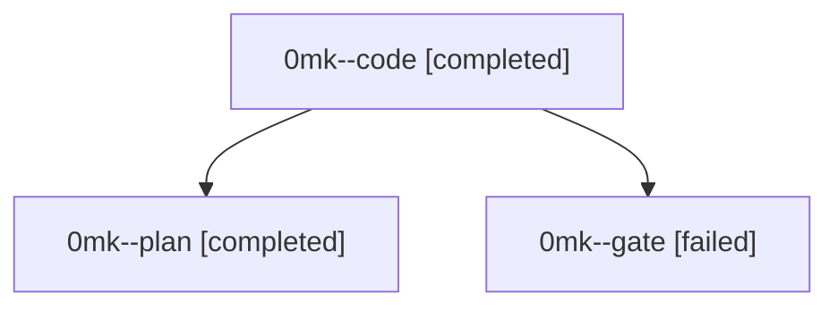

# Family: 0mk

[Agent Hoods](../README.md) / [bbugyi200](../users/bbugyi200/README.md) / [athena](../users/bbugyi200/machines/athena/README.md) / [0mk](../users/bbugyi200/machines/athena/hoods/0mk/README.md) / 0mk

Owner: `bbugyi200.athena` · Hood: `0mk` · Members: 3

## Lineage

The diagram is an optional enhancement; the ordered table below contains the same lineage in accessible text.

| Role | Agent | State | Model / provider | Timing | Commits | Prompt | Chat |
|---|---|---|---|---|---:|---|---|
| code | 0mk--code | completed | gpt-5.5 / codex | 2026-09-17T19:44:39.391012+00:00 → 2026-09-17T21:20:16.565462+00:00 | [1](../agents/bbugyi200.athena.0mk--code/README.md#commits) | [Prompt](../agents/bbugyi200.athena.0mk--code/prompt.md) | [Chat](../agents/bbugyi200.athena.0mk--code/chat.md) |
| plan | 0mk--plan | completed | claude-fable-5 / claude | 2026-09-17T19:34:39.078866+00:00 → 2026-09-17T19:40:22.595817+00:00 | 0 | [Prompt](../agents/bbugyi200.athena.0mk--plan/prompt.md) | [Chat](../agents/bbugyi200.athena.0mk--plan/chat.md) |
| gate | 0mk--gate | failed | claude-fable-5 / claude | 2026-09-17T19:43:37.195192+00:00 → 2026-09-17T19:44:21.703168+00:00 | 0 | — | [Chat](../agents/bbugyi200.athena.0mk--gate/chat.md) |

## Commits

| Role | Repo | Commit | Subject | Committed |
|---|---|---|---|---|
| code | sase | [`5e4c866`](https://github.com/sase-org/sase/commit/5e4c866eb5e5a4b6385855404078bc7fc9074fe0) | feat(tui): move agent panel layout toggle into grouping picker | 2026-09-17 17:01:35 EDT |
