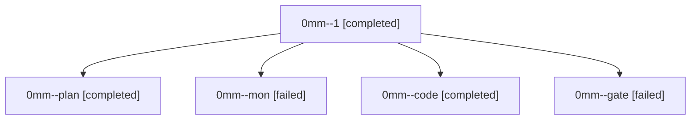

# Family: 0mm

[Agent Hoods](../README.md) / [bbugyi200](../users/bbugyi200/README.md) / [athena](../users/bbugyi200/machines/athena/README.md) / [0mm](../users/bbugyi200/machines/athena/hoods/0mm/README.md) / 0mm

Owner: `bbugyi200.athena` · Hood: `0mm` · Members: 5

## Lineage

The diagram is an optional enhancement; the ordered table below contains the same lineage in accessible text.

| Role | Agent | State | Model / provider | Timing | Commits | Prompt | Chat |
|---|---|---|---|---|---:|---|---|
| 1 | 0mm--1 | completed | gpt-5.5 / codex | 2026-09-18T08:14:36.549022+00:00 → 2026-09-18T08:26:28.671829+00:00 | 0 | [Prompt](../agents/bbugyi200.athena.0mm--1/prompt.md) | [Chat](../agents/bbugyi200.athena.0mm--1/chat.md) |
| plan | 0mm--plan | completed | opus / claude | 2026-09-18T07:17:31.866077+00:00 → 2026-09-18T07:24:57.511207+00:00 | 0 | [Prompt](../agents/bbugyi200.athena.0mm--plan/prompt.md) | [Chat](../agents/bbugyi200.athena.0mm--plan/chat.md) |
| mon | 0mm--mon | failed | gpt-5.5 / codex | 2026-09-18T07:34:53.972116+00:00 → 2026-09-18T08:15:03.387164+00:00 | 0 | — | [Chat](../agents/bbugyi200.athena.0mm--mon/chat.md) |
| code | 0mm--code | completed | gpt-5.5 / codex | 2026-09-18T07:26:03.776060+00:00 → 2026-09-18T07:35:48.476483+00:00 | 0 | [Prompt](../agents/bbugyi200.athena.0mm--code/prompt.md) | [Chat](../agents/bbugyi200.athena.0mm--code/chat.md) |
| gate | 0mm--gate | failed | opus / claude | 2026-09-18T07:24:59.236462+00:00 → 2026-09-18T07:25:45.631613+00:00 | 0 | — | [Chat](../agents/bbugyi200.athena.0mm--gate/chat.md) |
