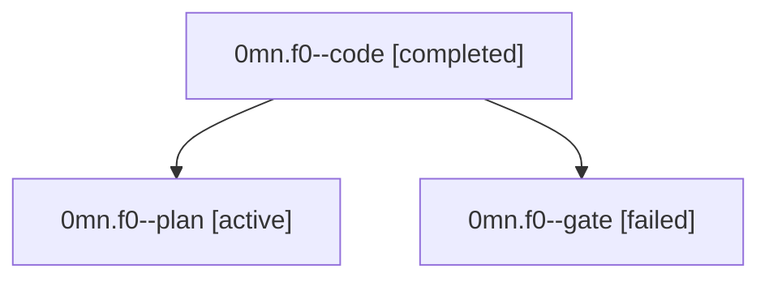

# Family: 0mn.f0

[Agent Hoods](../README.md) / [bbugyi200](../users/bbugyi200/README.md) / [athena](../users/bbugyi200/machines/athena/README.md) / [0mn](../users/bbugyi200/machines/athena/hoods/0mn/README.md) / 0mn.f0

Owner: `bbugyi200.athena` · Hood: `0mn` · Members: 3

## Lineage

The diagram is an optional enhancement; the ordered table below contains the same lineage in accessible text.

| Role | Agent | State | Model / provider | Timing | Commits | Prompt | Chat |
|---|---|---|---|---|---:|---|---|
| code | 0mn.f0--code | completed | gpt-5.5 / codex | 2026-09-18T10:22:42.294565+00:00 → 2026-09-18T11:11:46.058197+00:00 | [1](../agents/bbugyi200.athena.0mn.f0--code/README.md#commits) | [Prompt](../agents/bbugyi200.athena.0mn.f0--code/prompt.md) | [Chat](../agents/bbugyi200.athena.0mn.f0--code/chat.md) |
| plan | 0mn.f0--plan | active | gpt-5.6-sol / codex | 2026-09-18T10:16:05.099905+00:00 | 0 | [Prompt](../agents/bbugyi200.athena.0mn.f0--plan/prompt.md) | [Chat](../agents/bbugyi200.athena.0mn.f0--plan/chat.md) |
| gate | 0mn.f0--gate | failed | gpt-5.6-sol / codex | 2026-09-18T10:20:45.412613+00:00 → 2026-09-18T10:21:58.826900+00:00 | 0 | — | [Chat](../agents/bbugyi200.athena.0mn.f0--gate/chat.md) |

## Commits

| Role | Repo | Commit | Subject | Committed |
|---|---|---|---|---|
| code | sase | [`f7ea41d`](https://github.com/sase-org/sase/commit/f7ea41d3b22a8d4a3dfb5862cf393395cdf5e9b3) | fix(memory): dedupe linked child references | 2026-09-18 07:08:59 EDT |

## Neighbors

| Agent | Relation | State |
|---|---|---|
| [0mn](bbugyi200.athena.0mn.md) (family · 3) | ancestor | active 1, completed 1, failed 1 |
