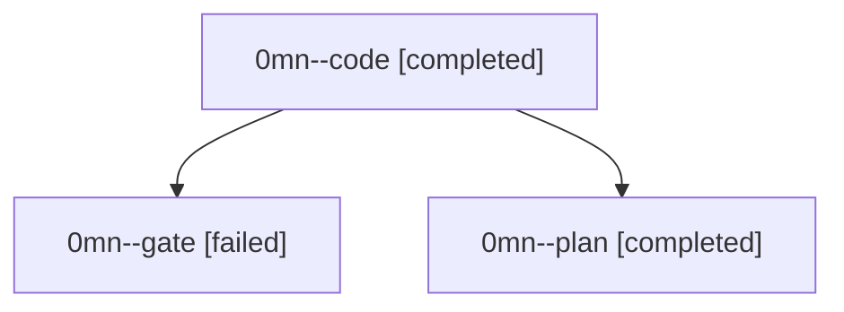

# Family: 0mn

[Agent Hoods](../README.md) / [bbugyi200](../users/bbugyi200/README.md) / [athena](../users/bbugyi200/machines/athena/README.md) / [0mn](../users/bbugyi200/machines/athena/hoods/0mn/README.md) / 0mn

Owner: `bbugyi200.athena` · Hood: `0mn` · Members: 3

## Lineage

The diagram is an optional enhancement; the ordered table below contains the same lineage in accessible text.

| Role | Agent | State | Model / provider | Timing | Commits | Prompt | Chat |
|---|---|---|---|---|---:|---|---|
| code | 0mn--code | completed | gpt-5.5 / codex | 2026-09-18T09:31:40.224546+00:00 → 2026-09-18T09:49:28.756866+00:00 | [1](../agents/bbugyi200.athena.0mn--code/README.md#commits) | [Prompt](../agents/bbugyi200.athena.0mn--code/prompt.md) | [Chat](../agents/bbugyi200.athena.0mn--code/chat.md) |
| gate | 0mn--gate | failed | gpt-5.6-sol / codex | 2026-09-18T09:30:42.863597+00:00 → 2026-09-18T09:31:21.884119+00:00 | 0 | — | [Chat](../agents/bbugyi200.athena.0mn--gate/chat.md) |
| plan | 0mn--plan | completed | gpt-5.6-sol / codex | 2026-09-18T09:24:29.793515+00:00 → 2026-09-18T09:28:06.340413+00:00 | 0 | [Prompt](../agents/bbugyi200.athena.0mn--plan/prompt.md) | [Chat](../agents/bbugyi200.athena.0mn--plan/chat.md) |

## Commits

| Role | Repo | Commit | Subject | Committed |
|---|---|---|---|---|
| code | sase | [`c331faa`](https://github.com/sase-org/sase/commit/c331faace3696c26d58f941a6500174d8e603a17) | fix(memory): render tui child memories as references | 2026-09-18 05:46:50 EDT |
