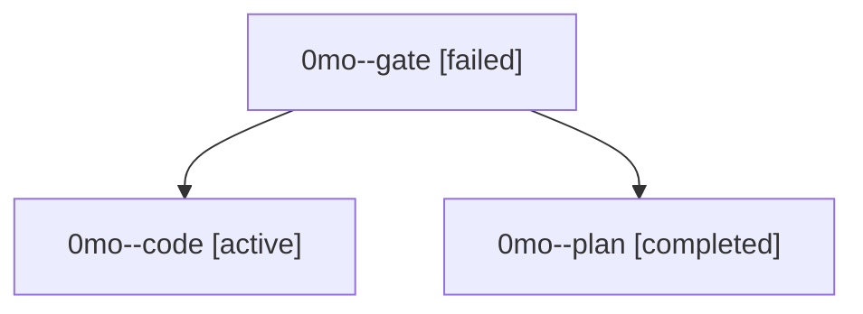

# Family: 0mo

[Agent Hoods](../README.md) / [bbugyi200](../users/bbugyi200/README.md) / [athena](../users/bbugyi200/machines/athena/README.md) / [0mo](../users/bbugyi200/machines/athena/hoods/0mo/README.md) / 0mo

Owner: `bbugyi200.athena` · Hood: `0mo` · Members: 3

## Lineage

The diagram is an optional enhancement; the ordered table below contains the same lineage in accessible text.

| Role | Agent | State | Model / provider | Timing | Commits | Prompt | Chat |
|---|---|---|---|---|---:|---|---|
| gate | 0mo--gate | failed | gpt-5.6-sol / codex | 2026-09-18T09:33:58.796488+00:00 → 2026-09-18T09:34:45.964243+00:00 | 0 | — | [Chat](../agents/bbugyi200.athena.0mo--gate/chat.md) |
| code | 0mo--code | active | gpt-5.5 / codex | 2026-09-18T09:35:12.781924+00:00 | [1](../agents/bbugyi200.athena.0mo--code/README.md#commits) | [Prompt](../agents/bbugyi200.athena.0mo--code/prompt.md) | — |
| plan | 0mo--plan | completed | gpt-5.6-sol / codex | 2026-09-18T09:29:04.219897+00:00 → 2026-09-18T09:33:51.072375+00:00 | 0 | [Prompt](../agents/bbugyi200.athena.0mo--plan/prompt.md) | [Chat](../agents/bbugyi200.athena.0mo--plan/chat.md) |

## Commits

| Role | Repo | Commit | Subject | Committed |
|---|---|---|---|---|
| code | sase | [`d3ee151`](https://github.com/sase-org/sase/commit/d3ee151fd97ec0acfaae2db7d06b6ccc88fdf03f) | fix(init): keep completed machine onboarding quiet | 2026-09-18 06:07:13 EDT |
