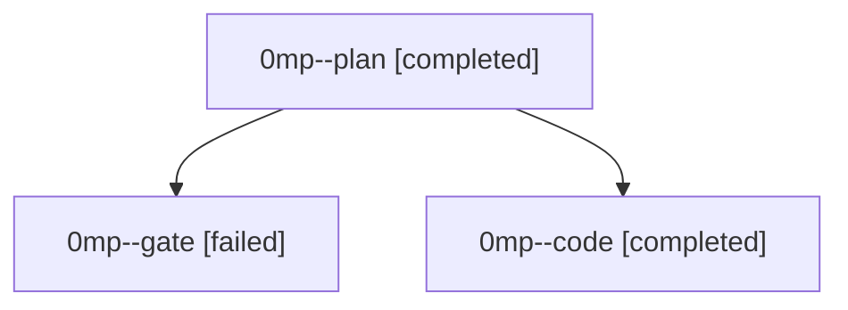

# Family: 0mp

[Agent Hoods](../README.md) / [bbugyi200](../users/bbugyi200/README.md) / [athena](../users/bbugyi200/machines/athena/README.md) / [0mp](../users/bbugyi200/machines/athena/hoods/0mp/README.md) / 0mp

Owner: `bbugyi200.athena` · Hood: `0mp` · Members: 3

## Lineage

The diagram is an optional enhancement; the ordered table below contains the same lineage in accessible text.

| Role | Agent | State | Model / provider | Timing | Commits | Prompt | Chat |
|---|---|---|---|---|---:|---|---|
| plan | 0mp--plan | completed | gpt-6-astra / codex | 2026-09-18T09:31:01.966070+00:00 → 2026-09-18T09:37:21.503108+00:00 | 0 | [Prompt](../agents/bbugyi200.athena.0mp--plan/prompt.md) | [Chat](../agents/bbugyi200.athena.0mp--plan/chat.md) |
| gate | 0mp--gate | failed | gpt-6-astra / codex | 2026-09-18T09:38:12.732019+00:00 → 2026-09-18T09:38:59.992992+00:00 | 0 | — | [Chat](../agents/bbugyi200.athena.0mp--gate/chat.md) |
| code | 0mp--code | completed | gpt-5.5 / codex | 2026-09-18T09:39:26.769498+00:00 → 2026-09-18T09:59:01.443513+00:00 | [1](../agents/bbugyi200.athena.0mp--code/README.md#commits) | [Prompt](../agents/bbugyi200.athena.0mp--code/prompt.md) | [Chat](../agents/bbugyi200.athena.0mp--code/chat.md) |

## Commits

| Role | Repo | Commit | Subject | Committed |
|---|---|---|---|---|
| code | sase | [`9f9f0d6`](https://github.com/sase-org/sase/commit/9f9f0d6f1c9c05995bba8b5966c19a5edf872f5e) | fix(tui): restore full notification backlog access | 2026-09-18 05:56:27 EDT |
